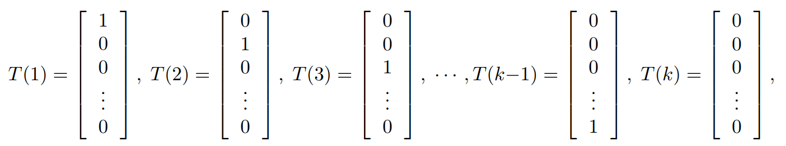

# ML Note1 线性回归
线性的规划中，假设函数（hypothesis）被设定为

$$
h(x)=\sum_{i=1}^n \theta _i x_i=\theta ^T x
$$

损失函数(cost function)

$$
J(\theta)=\frac{1}{2}\sum_{i=1}^{m}(h(x^{(i)})-y^{(i)})
$$
## 1.LMS algorithm
取一个 $\theta$ 使得 J 最小。
=== "Batch gradient descent"
     

    $\alpha：learning\ rate$
=== "Stochastic gradient descent"
    

!!!NOTE "二者比较"
    - Batch是可以得到收敛解的，而stochastic大概率会在最优解处振荡。但是后者可以较好处理大数据情况

## 2.The normal equations

!!! NOTE "矩阵的求导"
    - 

!!! NOTE "矩阵迹的基本性质"
    - $$\begin{cases}
    trABC = trCAB = trBCA\\
    trABCD = trDABC = trCDAB = trBCDA\\
    trA = trA^T\\
    tr(A + B) = trA + trB\\
    tr\ aA = a\ trA
    \end{cases}
    $$

!!! NOTE "矩阵的迹与微分的关系"
    -

#### The normal equations

$$
X^T Xθ = X^Ty
$$

$$
θ = (X^T X)^{-1}X^Ty.
$$

## 3.Probabilistic interpretation
从概率角度解释：为什么最小二乘损失函数J是一个比较好的选择？  

假设

$$y^{(i)}=\theta^Tx^{(i)}+\epsilon^{(i)}$$

并假设 $\epsilon^{(i)}$ 的分布为

$$p(\epsilon^{(i)})=\frac{1}{\sqrt{2\pi}\sigma}exp(-\frac{(y^{(i)}-\theta^Tx^{(i)})^2}{2\sigma^2})$$

极大似然估计函数为

$$L(\theta)=\prod_{i=1}^{m}\frac{1}{\sqrt{2\pi}\sigma}exp(-\frac{(y^{(i)}-\theta^Tx^{(i)})^2}{2\sigma^2})$$

取对数后，发现实际就是求最小值

$$J(\theta)=\frac{1}{2}\sum_{i=1}^{m}(h(x^{(i)})-y^{(i)})$$

## 4.Locally weighted regression
Fit $\theta$ to minimize 

$$\sum_{i=1}^{m}w^{(i)}(y^{(i)}-\theta^Tx^{(i)})^2$$

where $w^{(i)}$ is defined by 

$$w^{(i)}=exp\{-\frac{(x^{(i)}-x)^2}{2\tau^2}\}$$

τ is called the **bandwidth parameter**

---
## 5.Logistic regression
·针对的是binary classification problem。
### 新的假设函数
对于分类型问题，线性最小二乘并没那么有效。  

我们引入一个Logistic funtcion 

$$g(z)=\frac{1}{1+e^{-z}}$$

!!! NOTE "g(z)的一个性质"
    - $$g'(z)=g(z)g(1-z)$$

选择新的假设函数

$$h_\theta(x)=g(\theta^Tx)=\frac{1}{1+e^{-\theta^Tx}}$$

### 解决思路
假设

$$
P(y=1|x;\theta)=h_\theta(x)
$$

$$
P(y=0|x;\theta)=1-h_\theta(x)
$$

那么

$$P(y|x;\theta)=h^y_\theta(x)(1-h_\theta(x))^{1-y}$$

最大似然函数 

  

这里，我们是要求似然函数的最大值，所以采取梯度上升

$$
\theta:=\theta+\alpha\nabla_\thetaℓ(θ)
$$

$$
\theta_j:=\theta_j+\alpha(y^{(i)}-h(x^{(i)}))x_j^{(i)}
$$
## 6.Another algorithm for maximizing $ℓ(θ)$
### Newtown's method
牛顿方法是一种找零点的方法。  

对某些函数 $f : R → R$ ,选取一个 $\theta_0$ ，逐步下降最后趋近于0  

$$
\theta:=\theta-\frac{f(\theta)}{f'(\theta)}
$$
### 应用
注意到：在$ℓ(θ)$的最大点处，$ℓ'(θ)=0$ 。利用这一点我们得到更新方案

$$
\theta:=\theta-\frac{ℓ'(θ)}{ℓ'’(θ)}
$$
### 推广
如果 $\theta$ 是一个多维的向量，那么更新方案改为

$$θ := θ - H^{-1}∇_θℓ(θ).$$

其中H是Hessian矩阵，

$$H_{ij}=\frac{\partial^2ℓ(θ).}{\partial \theta_i \partial \theta_j}$$

---

## 7.The exponential familly 

Exponential familly 
:   如果一类分布可以写成 $p(y; η) = b(y) exp(η^T T (y) - a(η))$

$\eta$ 特征参数
:   natrual parameter(canonical parameter)of the distribution 一般为向量

$T(y)$ 充分统计量
:   sufficient statistic ，代表样本的分布情况（均值，方差等），包含样本的所有信息。

$a(\eta)$ 对数分配函数
:   log partition function
	
!!! NOTE
    - 伯努利分布以及高斯分布都是指数分布族
    - 多项式、泊松、gamma、beta、指数……
=== "伯努利分布的特征函数"
    
=== "高斯分布的特征函数"
    

## 8.Consturcting GLMs
广义线性回归，其实就是通过某个激活函数，将线性回归的输出值映射成不同的分布。

构建一个GLM模型，一般建立在三个假设上

1. $y | x; θ \sim ExponentialFamily(η)$
2. $T(y)=y$ ,这意味着我们需要让我们的假设函数h去满足 $h(x)=E[y|x]$
3. 特征参数 $\eta$ 与输入x之间满足线性关系 $\eta=\theta^Tx$

=== "Ordinary Least Squares"
    $$
    h_θ(x) = E[y|x; θ]= µ = η = θ^Tx.
    $$

=== "Logistic Regression"
    $$
    h_θ(x) = E[y|x; θ]= \phi = 1/(1 + e^{-η})= 1/(1 + e^{-θ^T x})
    $$

!!! NOTE canonical response function
    - $g(\eta)=E[T(y);\eta]$被称为正则响应函数canonical response function
    - $g^{-1}$被成为正则链接函数canonical link function

### Softmax Regression
在这个问题中，y可以取k个值{1,2,...,k}
#### a.设定概率
设

$$
\phi_i=p(y=i;\phi) \quad i=1,2,...,k-1
$$
来表示取不同值的概率

那么很容易就有

$$
\phi_k=p(y=k;\phi)=1-\sum_{i=1}^{k-1}\phi_i
$$
#### b.设定T(y)
在这里T(y)被设定为一个k-1维的向量，因为本问题的输出为k-1个概率组成的向量（于是可以得出第k个的概率），前面logistic的情况理解为k=2。

用 $(T(y))_i$ 表示T(y)的第i个分量,T(i)的第i个分量为1。

!!! NOTE "1{ } 计数"
    - 设定1{True}=1,1{False}=0

$$
(T(y))_i=1\{y=i\}
$$

$$
E[(T (y))_i] = P (y = i) = \phi_i.
$$

#### c.搭建GLM
$$
\begin{align}
p(y; \phi) &= \phi_1^{1\{y=1\}}\phi_2^{1\{y=2\}}...\phi_k^{1\{y=k\}}\\
&=exp((T (y))_1 log(φ_1/φ_k) + (T (y))_2 log(φ_2/φ_k) + · · · +(T (y))_{k-1} log(φ_{k-1}/φ_k) + log(φ_k))\\
&=b(y) exp(η^T T (y) - a(η))
\end{align}
$$

可以得到一些特征函数

!!! note "经过进一步推导，可以发现关系softmax function"
    $$
    \phi_i = \frac{e^{\eta_i}}{\sum_{i=1}^{k}e^{\eta_i}}
    $$

根据假设3：$η_i = θ_i^T x$ 最终可以得到输出

