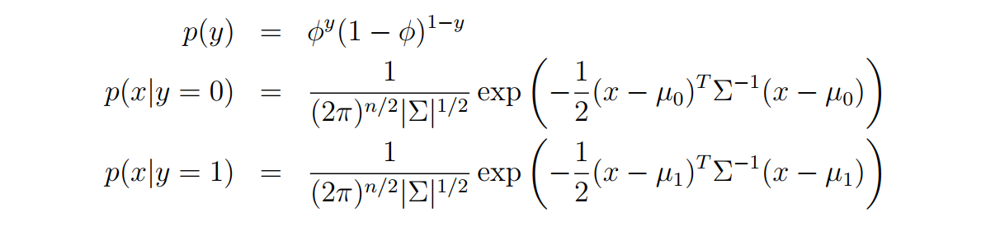
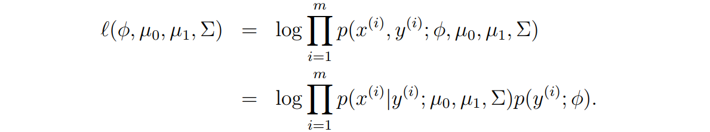
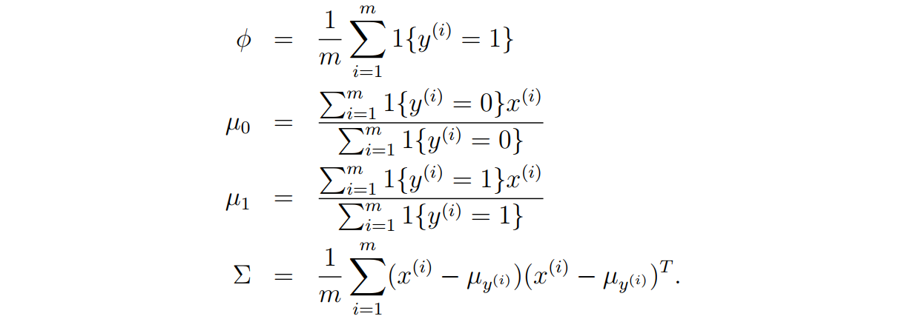
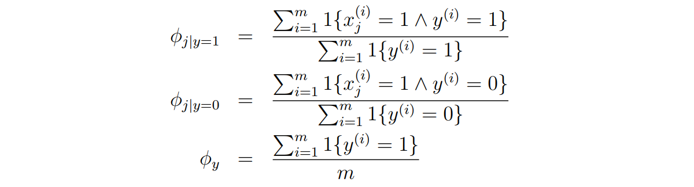
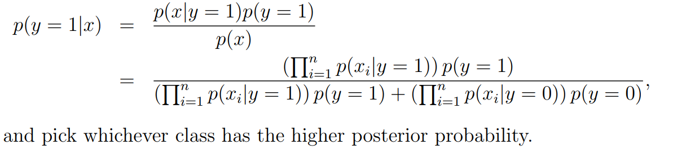
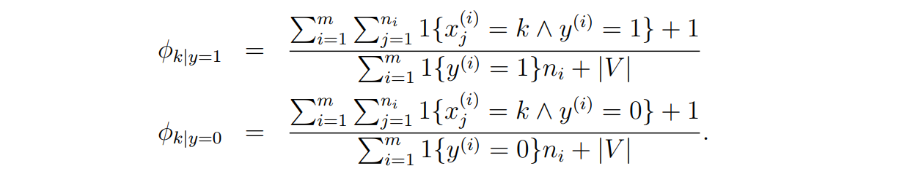

上述所通过学习 $p(y|x)$ 的方法被称为**判别学习方法**(discriminative learning algorithms)。

进一步地，我们学习**生成学习算法**(generative learning algorithms),通过学习 $p(x|y)$ 与 $p(y)$ 来建模。

## 1.Gaussian discriminant analysis(GDA)
### The multivariate normal distribution 多维正态分布
此时 $\mu$ 为一个n维的向量，$\Sigma$ 为一个 $n\times n$的矩阵。

概率密度为：

$$
p(x;\mu,\Sigma)=\frac{1}{(2\pi)^{n/2}|\Sigma|^{1/2}}exp(-\frac{1}{2}(x-\mu)^T \Sigma^{-1}(x-\mu))
$$

对于服从 $N(\mu,\Sigma)$ 的变量X，$E[X]=\mu$,$Cov(X)=\Sigma$

### The Gaussian Discriminant Analysis model
建立模型如下

根据分布写出概率函数

对数似然函数

解为

!!! NOTE GDA与Logistic回归
    - GDA做了更强的建模假设，并且更当建模假设正确或至少近似正确时做的会比较好。
    - Logistic回归做出的假设更弱，具体来说，当数据确实是非高斯的，那么在大数据集的限制下，逻辑回归几乎总是比GDA做得更好。由于这个原因，在实践中，逻辑回归比GDA更常用。
## Naive Bayes 朴素贝叶斯

!!! question 一个文本归类的问题
    - 假设我们有一个训练集(一组标记为垃圾邮件或非垃圾邮件的电子邮件)。我们将通过指定用于表示电子邮件的 特性来开始构建垃圾邮件过滤器。

训练集中的x向量被如此设定：如果这个邮件里出现了这个词，那么为该单词分量的值为1，所以x的规模将与字典的规模相当。

而因为字典规模非常非常大，我们需要做一个比较强的假设

!!! NOTE 朴素贝叶斯假设
    - 分量 $x_i$ 关于给定的y相互独立。
    - 因此我们获得
    
    $$p(x_1,..., x_{50000}|y)=\prod_{i=1}^{n}p(x_i|y)$$

建模方案：

$$
\begin{align}
φ_{i|y=1} &= p(x_i = 1|y = 1) \\
φ_{i|y=0} &= p(x_i = 1|y = 0)\\
φ_{y} &= p(y = 1).
\end{align}
$$

根据似然函数

解得：

最后，我们只需要检验哪一类的概率更大

### Laplace smoothing
在朴素贝叶斯中，将会出现 $\frac{0}{0}$ 的情况，或者在一些极端情况下（或者样本数较少的时候）出现某一分子为0的情况，此时我们需要对朴素贝叶斯的参数估计做出调整。

!!! NOTE "拉普拉斯平滑"
    - 一般来说，如果一个多项随机变量z可以取值{1,2,...,k}，那么他的概率（样本数为m）为 

    $$\phi_j=\frac{\sum_{i=1}^m1 \{z^{(i)}=j\}} {m}$$

    - 在使用拉普拉斯平滑后，概率修正为 
    
    $$\phi_j=\frac{\sum_{i=1}^m1 \{z^{(i)}=j\} +1}   {m+k}$$

### Event models for text classification
介绍另外一种关于处理文本的分类器(multinomial event model)。不同于前面使用字典大小的向量作为邮件的存储，在此处建模时，这里的向量大小为邮件的长度。

所以，第i个邮件 $x^{(i)}$（拥有 $n_i$ 的长度），第j个分量 $x_j$ 将在{1,2,...,|V|}中取值。

类似于上面使用朴素贝叶斯，并使用拉普拉斯平滑得到最后的解

