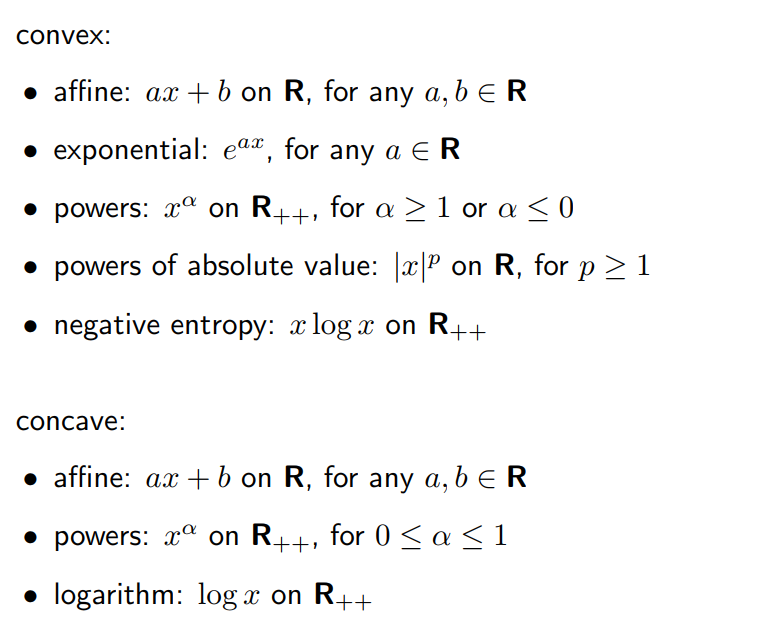
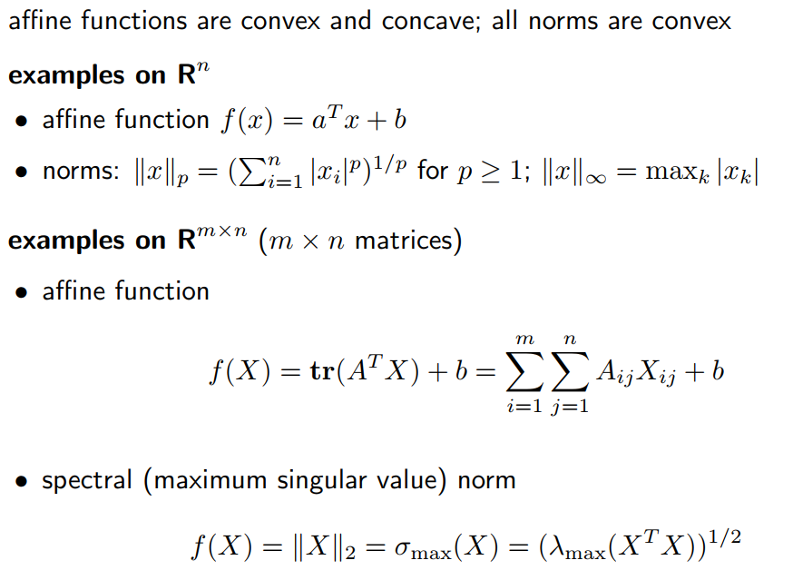
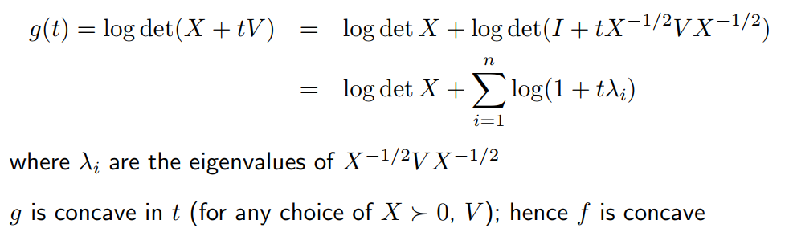
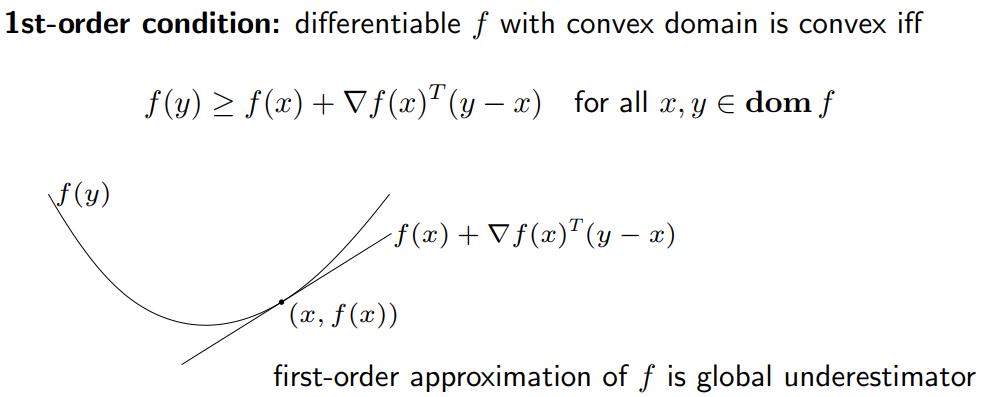
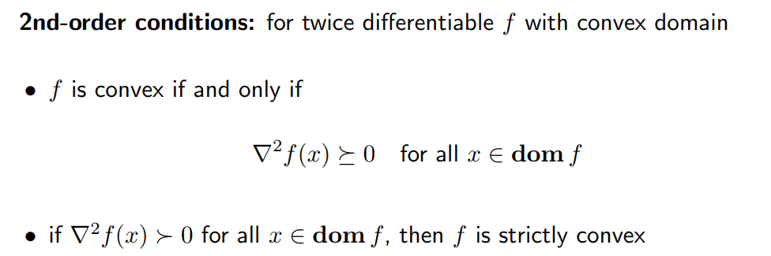
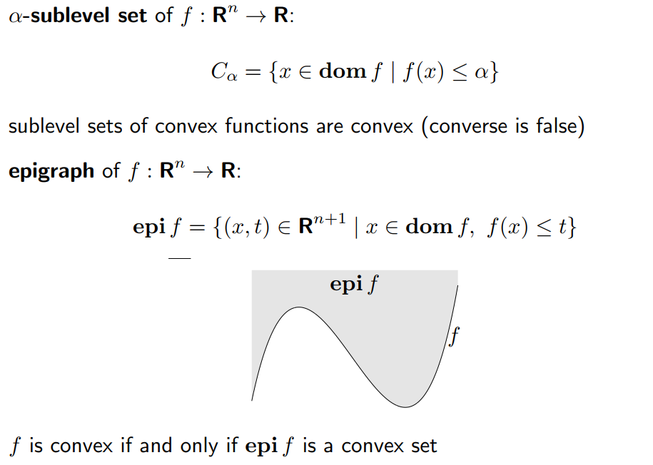
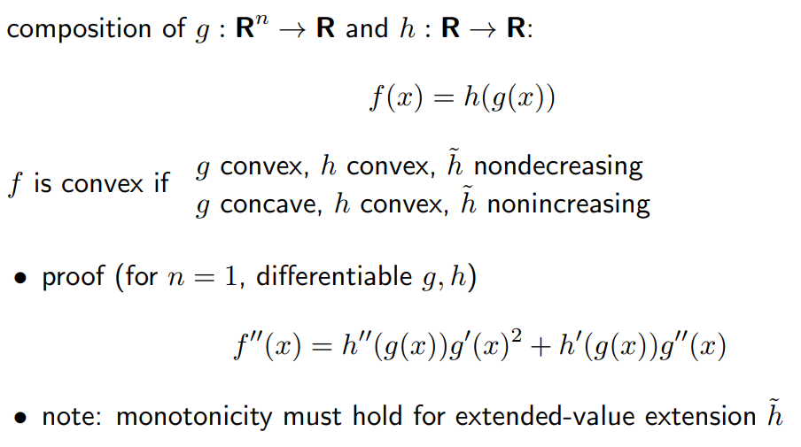
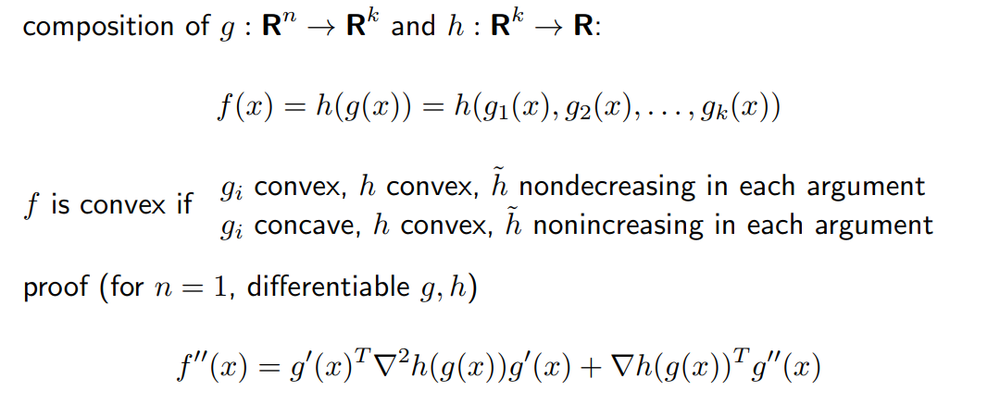
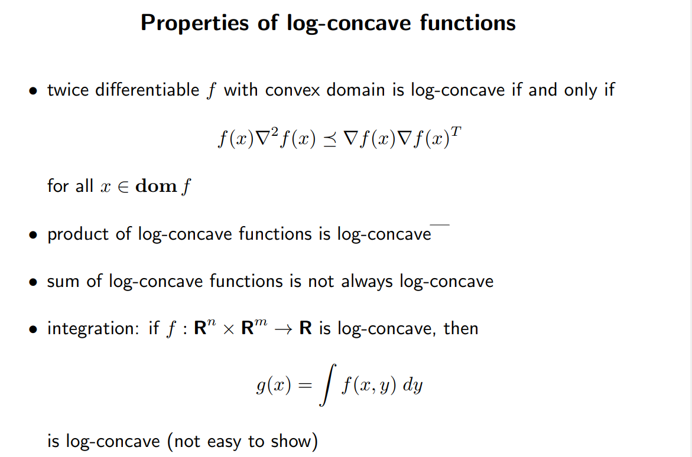
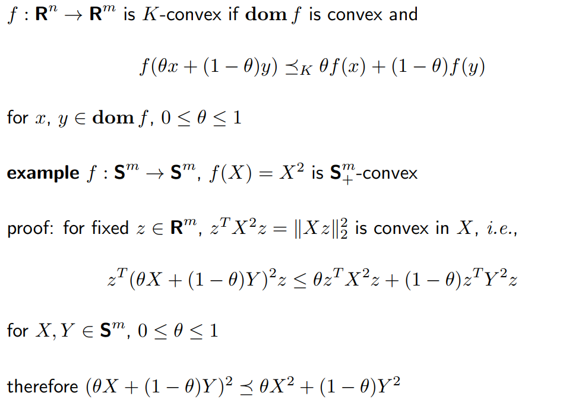

# Lec03 Convex Functions
## 1. Basic properties and examples
### 1.1 Definitiion
#### convex funtion
dom f is a convex set and 

$$
f(θx + (1 - θ)y) ≤ θf(x) + (1 - θ)f(y)
$$
for all $x,y\in dom\ f ,0\leq \theta \leq 1$
#### strictly convex funtion 
dom f is a convex set and 
$$
f(θx + (1 - θ)y) ≤ θf(x) + (1 - θ)f(y)
$$
for all $x\neq y\in dom\ f ,0<\theta < 1$
#### concave 
凹 

!!! example "Examples on R"
	- 

!!! example "Examples on $R^n$ and $R^{m\times n}$"
	- 

!!! NOTE "一个判断法则"
	- 判断 $f:R^n ->R$ 是否是凸的
	- 只需判断函数 $g:R->R\ g(t)=f(x+tv),\ dom g =\{ t| x+tv \in dom \ f \}$是否是凸的。
	- 举一个例子
	- 
### 1.2 Extended-value extension
we define $\tilde{f}$ is the extension of f,we get

$$
\tilde{f}(x)=
\begin{cases}
f(x)\quad x \ in\ dom \ f \\
\infty \quad \ \ \  x \notin \ dom \ f 
\end{cases}
$$

so we can extend the funtion to $R^n$
### 1.3 First-order condition 

### 1.4 Second-order conditions

### 1.5 Epigraph and sublevel set
上境图和$\alpha$-下水平集

### 1.6 Jensen's inequality
#### basic inequality
if f is convex,then for $0\leq \theta \leq 1$
$$
f(θx + (1 - θ)y) ≤ θf(x) + (1 - θ)f(y)
$$
#### extension 
if f is convex then, $x_1,...,x_k \in dom \ f ,\theta_1,...,\theta_k\geq 0$,$\theta_1+...+\theta_k=1$，则
$$
f(\theta_1x_1+···+\theta_kx_k)\leq \theta_1f(x_1)+...+\theta_kf(x_k)
$$
同理可以应用于积分
用概率来衡量，我们可以得到
$$
f(Ex)\leq Ef(x)
$$

!!! question "Holder不等式"
	- Contents

---

## 2. Operations that preserve convexity
1. 非负加权求和（积分）
2. 复合仿射映射 $f(Ax+b)$ is convex if f is convex
3. 逐点最大与逐点上确界
4. 标量复合  
   
5. 矢量复合  
   
6. 最小化
7. 透视函数
## 3.The conjugate function 共轭函数
#### conjugate function 

$$f^*(y)=sup_{x\in dom \ f}(y^Tx-f(x))$$

不论f是否是凸函数，$f^*$均为凸函数。

---

## 4.Quasiconvex functions 拟凸函数
#### definition

如果所有的下 $\alpha$ 水平集

$$S_\alpha= \{x\in dom \ f | f(x)\leq \alpha\}$$

都为凸集，那么为拟凸函数
#### properties
1. modified Jensen inequality:
	for quasiconvex f
$$
0 ≤ θ ≤ 1 =⇒ f(θx + (1 - θ)y) ≤ max\{f(x), f(y)\}
$$
2. first-order condition: 
	differentiable f with cvx domain is quasiconvex iff
$$
f(y) ≤ f(x) =⇒ ∇f(x)^T (y - x) ≤ 0
$$

---

## 5.Log-concave and log-convex functions
#### log-concave
a positive function f is log-concave if log f is concave:

$$f(θx + (1 - θ)y) ≥ f(x)^θf(y)^{1-θ}\  for\  0 ≤ θ ≤ 1$$

#### log-convex
f is log-convex if log f is convex
#### properties 

---

## 6.Convexity with respect to generalized inequalities
