# Lec04 Convex optimization problems
## 1.Optimization problem 优化问题
### 1.1Optimization problem in standard form
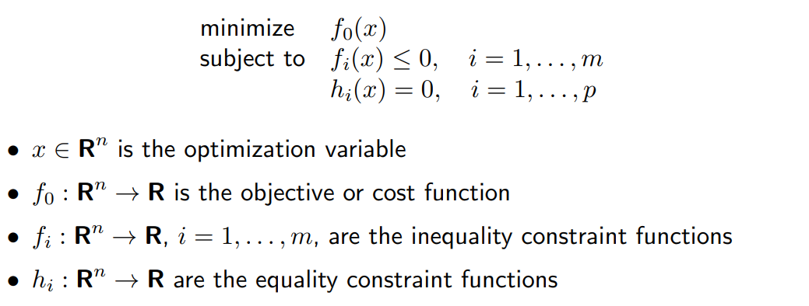
#### option value
$$p^*= inf\{f_0(x) | f_i(x) ≤ 0, i = 1, . . . , m, h_i(x) = 0, i = 1, . . . , p\}$$

如果问题不可行，取 p* 为 ∞

如果问题无下界，取 p* 为-∞

如果x可行且 $f_i(x)=0$，我们称约束 $f_i(x)\leq 0$ 的第i个不等式x处起作用

### 1.2 Optimal and locally optimal points
#### feasible 
x is feasible if $x ∈ dom f_0$ and it satisfies the constraints  
a feasible x is optimal if $f_0(x) = p^*$;$X_{opt}$ is the set of optimal points
#### local optimal 
x is local optimal if there is an R>0 such that x is optimal for   
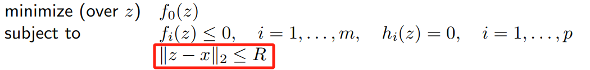

### 1.3 Implict constraints
we call the domain of the problem is   
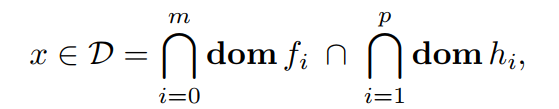

---
## 2.Convex optimization  凸优化
### 2.1 standard form convex optimization problem 
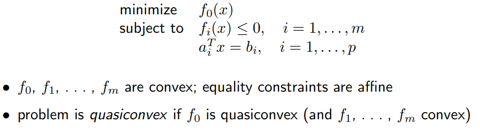
!!! NOTE "important property:"
    - feasible set of a convex optimization problem is convex
### 2.2 Local and global optima

!!! NOTE "In fact"
    - any locally optimal point of a convex problem is (globally) optimal
### 2.3 Optimality criterion for differentiable f0
x is optimal if and only if it is feasible and

$$
∇f_0(x)^T (y - x) ≥ 0
$$

### 2.4 Equivalent convex problems
### Equivalent convex problems
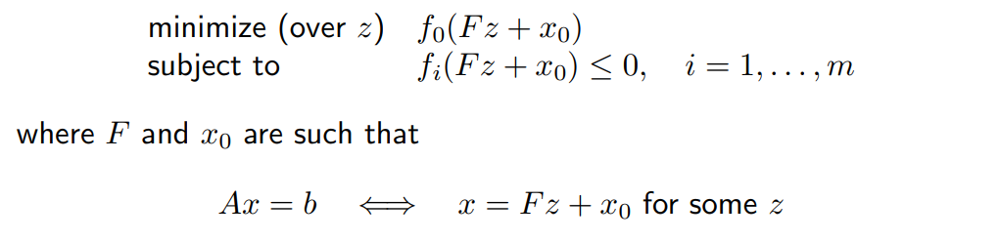
### introducing equality constraints
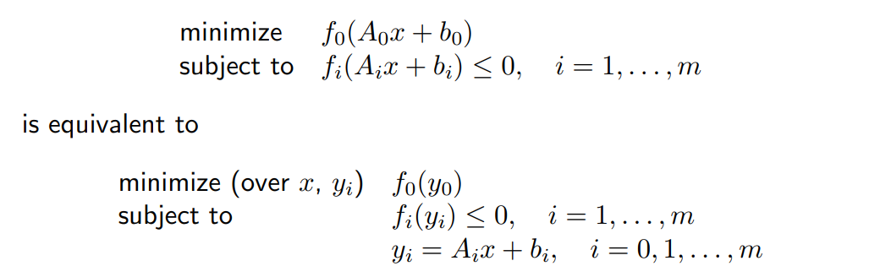
### introducing slack variables for linear inequalities
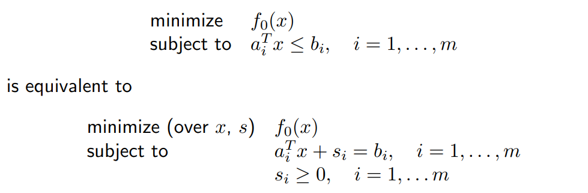
### epigraph form 
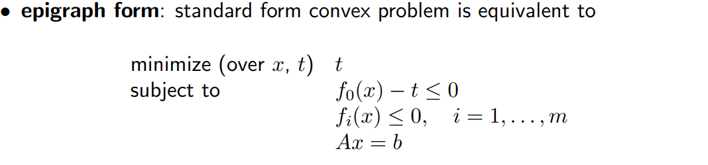
### minimizing over some variables(partial optimate)
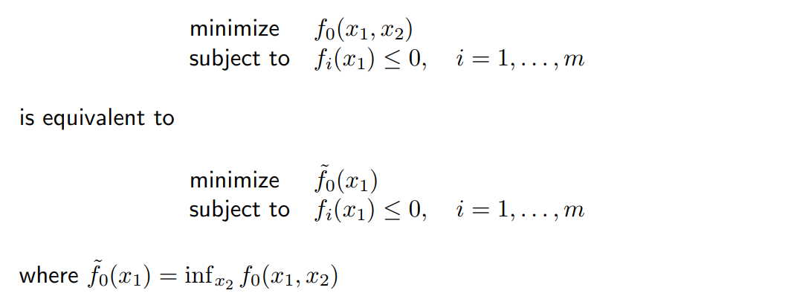

### 2.5 Quasiconvex optimization
when the $f_0$  is quaisconvex ,can have locally optimal points that are not globally optimal
### solution
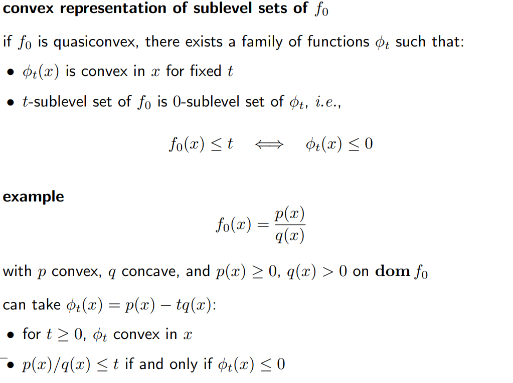
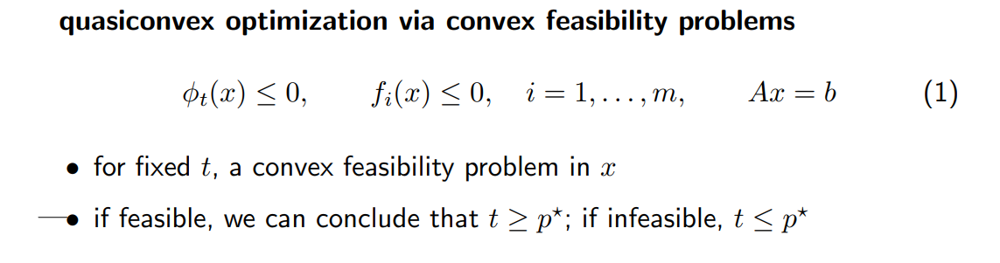

---
## 3. Linear program 线性规划问题 
$$
minimize \  c^Tx+d
$$

$$
subject \ to \ Gx≼ h
$$

$$
Ax=b
$$

feasible set is a polyhedron.
### Linear-fractional program 线性分式规划问题
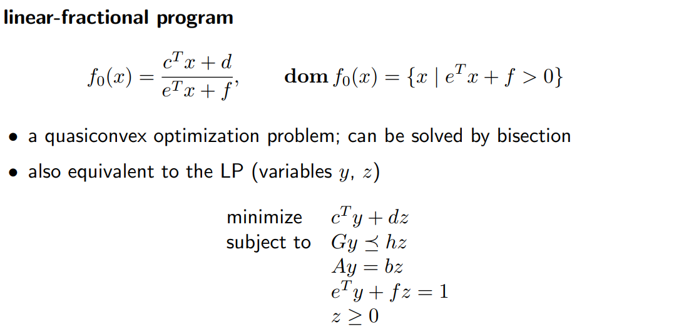

---
## 4.Quadratic program二次优化问题
### QP
目标函数为凸二次型，且约束函数为仿射。
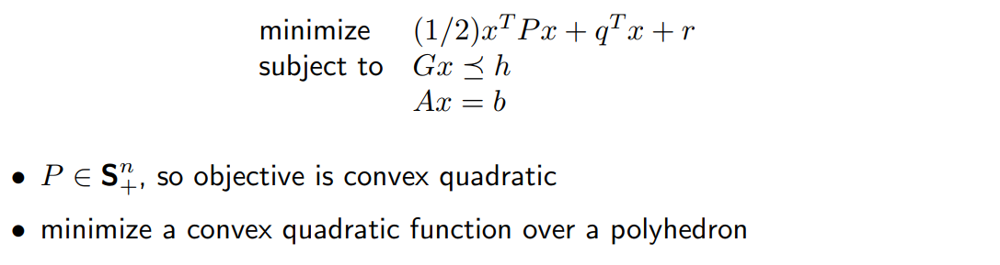
### QCQP
不等式约束也是凸二次型，则是QCQP
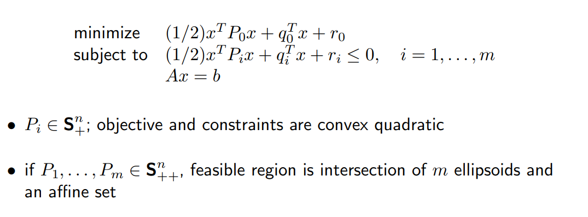

### Sencond-order cone programming (SOCP)
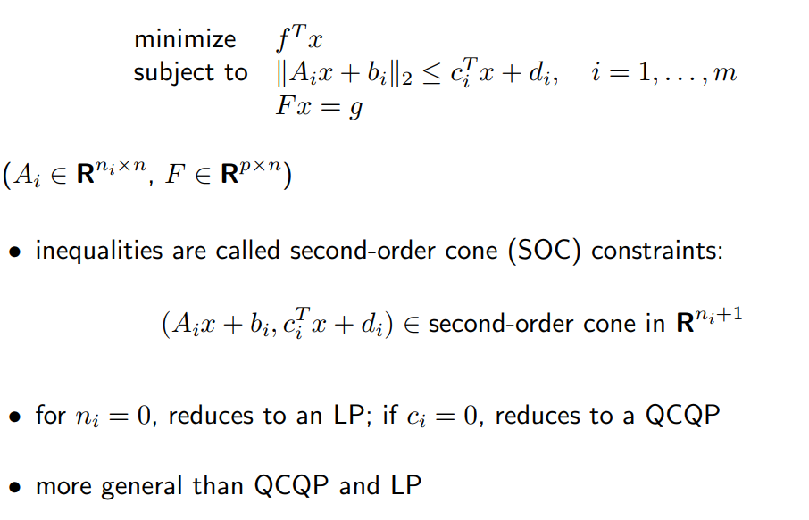

---
## 5.Geometric programming几何规划
### monimal function and posyminal function
 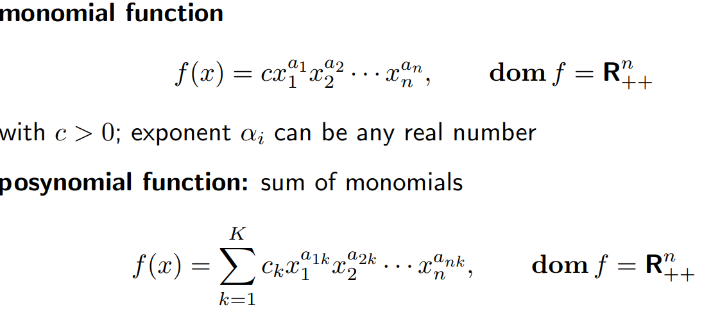
### GP
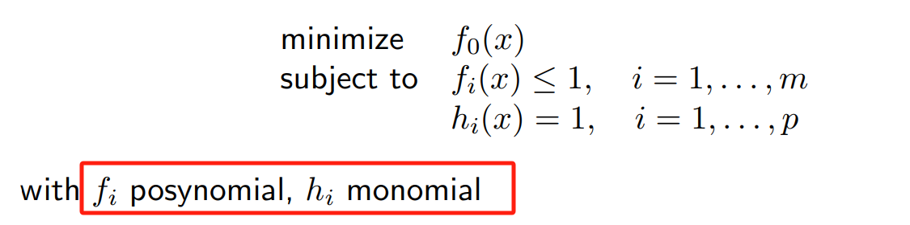

GP一般来说都不是凸问题，在此情况下可以转化为凸优化问题
#### solution 
$$
y_i=log\ x_i
$$

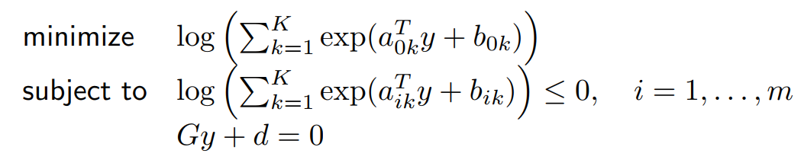

---
## 6.Generalized inequality constraints广义不等式约束
### convex problem with generalized inequality constraints
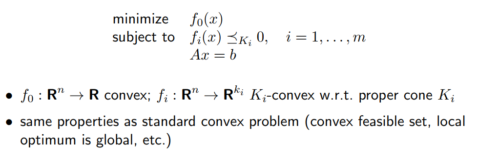
### conic form problem
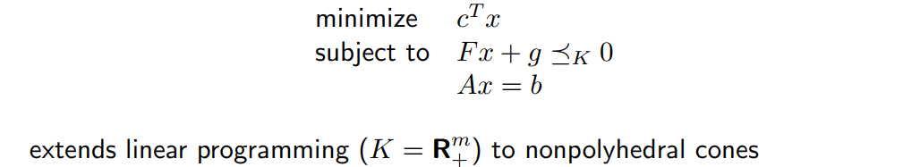
### Semidefinite program (SDP)
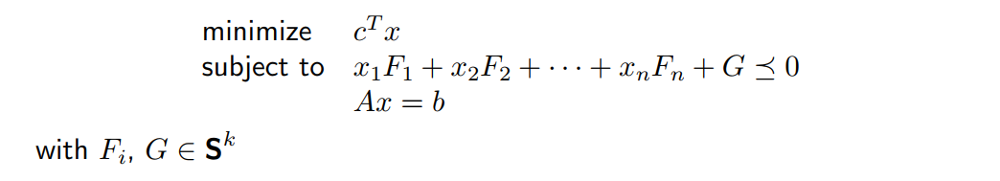

---
## 7.Vector optimization向量优化
### general and convex vector optimization problem
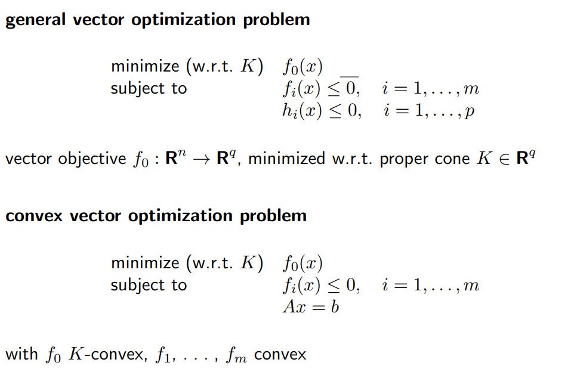
