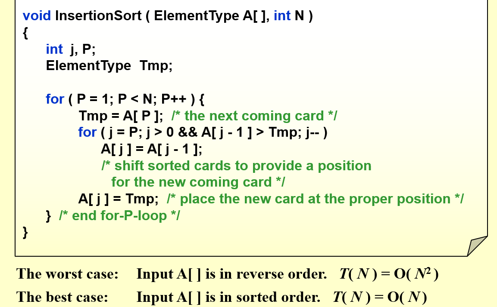
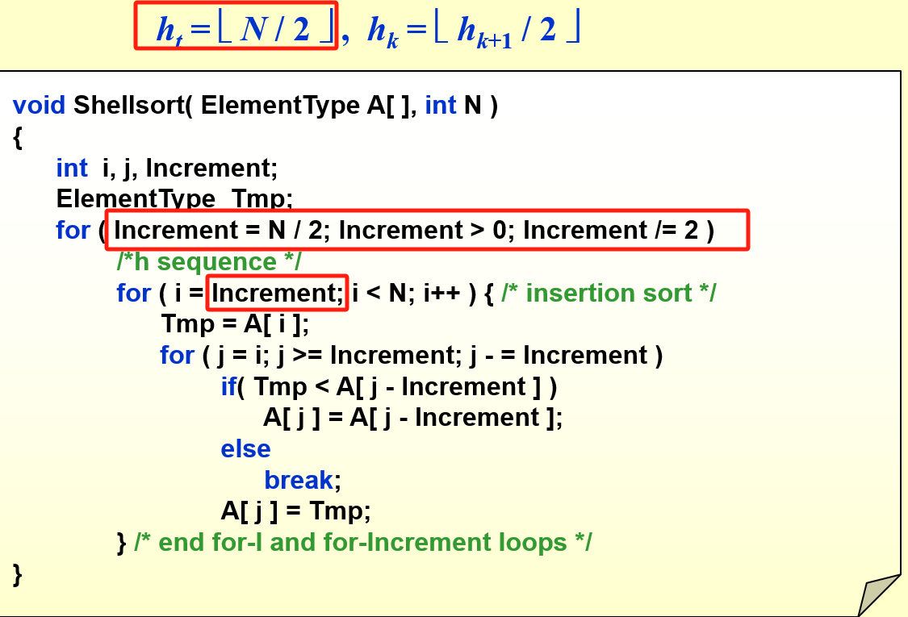
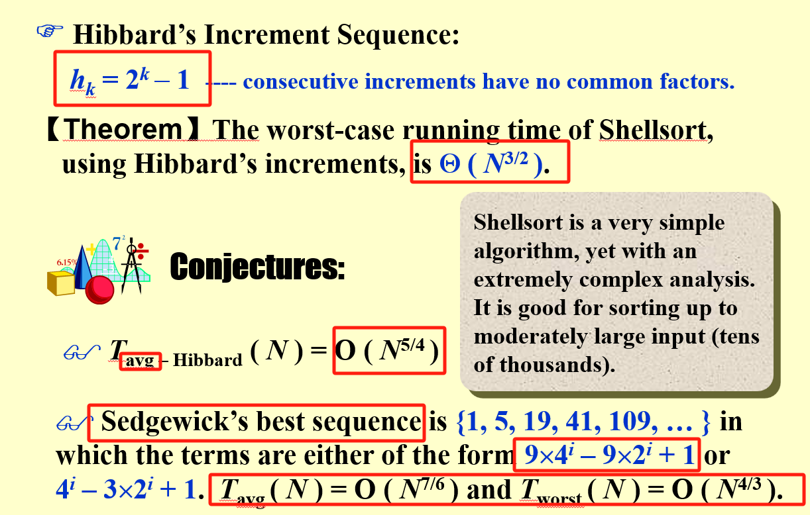
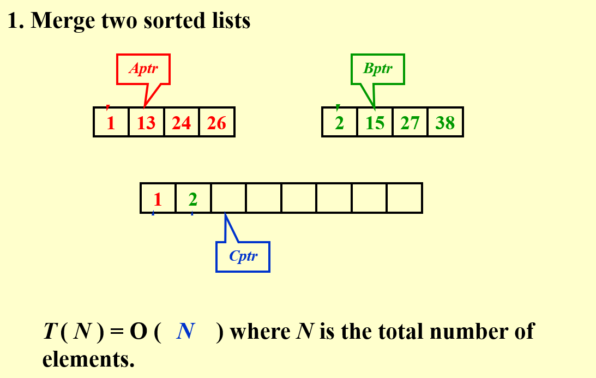
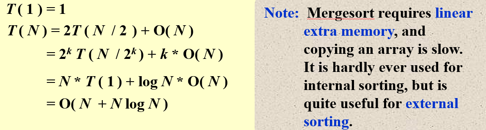
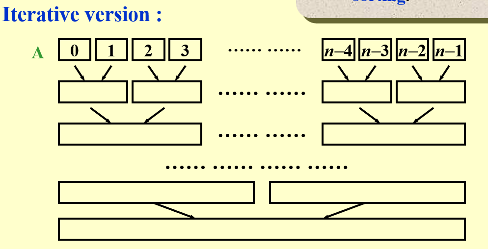

# Lec08 Sorting

## 一、Insertion Sort插入排序
### 1.程序

### 2.A Lower Bound for Simple Sorting Algorithms
一次交换相当于减去一对逆序对  

所以时间复杂度：  

$$T ( N, I ) = O(I+N )$$ 
where I is the number of inversions in the original array.

### 3.两个算法定理
【Theorem】The average number of inversions in an array of N distinct numbers is  N ( N - 1 ) / 4.  

【Theorem】Any algorithm that sorts by exchanging adjacent elements requires $\Omega( N^2 )$ time on average.

## 二、Shellsort
规定一个序列{$h_k$},$分别进行h_i-sort$ ，最后到1-sort，进行插入排序
### 1.Shell's increment sequence

!!! warning "Worst-Case Analysis"
	- 当选取的序列有倍数关系，那部分sort会无效，是shell序列的一个漏洞

### 2.Hibbard’s Increment Sequence
Sedgewick’s best sequence是当前最好的一个序列  

## 三、堆排序
小顶堆
```c
Algorithm 1:
{
     BuildHeap( H );
     for ( i=0; i<N; i++ )
		  TmpH[ i ] = DeleteMin( H );
     for ( i=0; i<N; i++ )
		  H[ i ] = TmpH[ i ];
}
```

$$T(N)=O(NlogN)$$

大顶堆：
```c
void Heapsort( ElementType A[ ], int N )
{  int i;
    for ( i = N / 2; i >= 0; i - - ) /* BuildHeap */
        PercDown( A, i, N );
    for ( i = N - 1; i > 0; i - - ) {
        Swap( &A[ 0 ], &A[ i ] ); /* DeleteMax */
        PercDown( A, 0, i );
    }
```

!!! quote "【Theorem】"
	The average number of comparisons used to heapsort a random permutation of N distinct items is
	$$
	    2N log N - O( N log log N ) 
	$$
	Although Heapsort gives the **best average time**, in practice it is **slower than a version of Shellsort** that uses Sedgewick’s increment sequence.

## 四、Mergesort归并排序
### 1.思路
使用三个指针，将两个已排序好的数组归并到一个数组里。时间复杂度为O（N）  

### 2.实现
```c
void MSort( ElementType A[ ], ElementType TmpArray[ ],int Left, int Right )
{   
	int  Center;
    if ( Left < Right ) {  /* if there are elements to be sorted */
	  Center = ( Left + Right ) / 2;
	  MSort( A, TmpArray, Left, Center );   /* T( N / 2 ) */
	  MSort( A, TmpArray, Center + 1, Right );   /* T( N / 2 ) */
	  Merge( A, TmpArray, Left, Center + 1, Right );  /* O( N ) */
    }
}

void Mergesort( ElementType A[ ], int N )
{   
	ElementType  *TmpArray;  /* need O(N) extra space */
    TmpArray = malloc( N * sizeof( ElementType ) );
    if ( TmpArray != NULL ) {
	  MSort( A, TmpArray, 0, N - 1 );
	  free( TmpArray );
    }
    else  FatalError( "No space for tmp array!!!" );
}

/* Lpos = start of left half, Rpos = start of right half */

void Merge( ElementType A[ ], ElementType TmpArray[ ],int Lpos, int Rpos, int RightEnd )
{   
	int  i, LeftEnd, NumElements, TmpPos;
    LeftEnd = Rpos - 1;
    TmpPos = Lpos;
    NumElements = RightEnd - Lpos + 1;
    
    /* main loop */
    while( Lpos <= LeftEnd && Rpos <= RightEnd )
        if ( A[ Lpos ] <= A[ Rpos ] )
			TmpArray[ TmpPos++ ] = A[ Lpos++ ];
        else
			TmpArray[ TmpPos++ ] = A[ Rpos++ ];
	/* Copy rest of first half */
    while( Lpos <= LeftEnd )
		TmpArray[ TmpPos++ ] = A[ Lpos++ ];
		
	/* Copy rest of second half */
    while( Rpos <= RightEnd )
        TmpArray[ TmpPos++ ] = A[ Rpos++ ];
        
    for( i = 0; i < NumElements; i++, RightEnd - - )
         /* Copy TmpArray back */
        A[ RightEnd ] = TmpArray[ RightEnd ];
}
```
!!! note "如果数组开在Merge内部，那么整个时间复杂度为O(NlogN)"
### 3.分析
#### 时间复杂度

####  非递归实现
跟相邻的元素进行Mergesort



## 五、Quicksort快速排序
### 1.算法思想
1. 设定一个pivot
2. 以pivot为分界线，分成左边（小于pivot）与右边（大于pivot）
3. 最后对左边再调用Qsort，右边也调用Qsort
4. 合并
```c
void Quicksort ( ElementType A[ ], int N )
{
     if ( N < 2 )  return;
     pivot = pick any element in A[ ];
     Partition S = { A[ ] \ pivot } into two disjoint sets:
		  A1={ a∈S | a<=pivot } and A2={ a∈S | a>= pivot };
     A = Quicksort ( A1, N1) È { pivot } È Quicksort ( A2, N2);
}
```
### 2.如何选取Pivot？
比较好的一种方式是取三者的平均值
$$
Pivot=median(left,center,right)
$$
### 3.Partitioning Strategy
对于选定的Pivot，如何让左边均为小，右边均为大？


### 4.For Small Arrays
Quicksort在数据较少的时候不一定快  

Cutoff when N gets small ( e.g. N = 10 ) and use other efficient algorithms (such as insertion sort).
### 5.实现
Median3函数的作用：将left，center，right的顺序按照从小到大的顺序排好，然后返回right-1的值  

Qsort主要函数思路：在左边搜索，如果碰到比pivot大的，停下来；后面再在右边搜索，如果碰到比pivot小的，停下来。交换i,j；

```c
void  Quicksort( ElementType A[ ], int N )
{
  Qsort( A, 0, N - 1 );
  /* A:   the array   */
  /* 0:   Left index   */
  /* N – 1: Right index  */
}
ElementType Median3( ElementType A[ ], int Left, int Right )
{
    int  Center = ( Left + Right ) / 2;
    if ( A[ Left ] > A[ Center ] )
        Swap( &A[ Left ], &A[ Center ] );
    if ( A[ Left ] > A[ Right ] )
        Swap( &A[ Left ], &A[ Right ] );
    if ( A[ Center ] > A[ Right ] )
        Swap( &A[ Center ], &A[ Right ] );
    /* Invariant: A[ Left ] <= A[ Center ] <= A[ Right ] */
    Swap( &A[ Center ], &A[ Right - 1 ] ); /* Hide pivot */
    /* only need to sort A[ Left + 1 ] … A[ Right – 2 ] */
    return  A[ Right - 1 ];  /* Return pivot */
}
void  Qsort( ElementType A[ ], int Left, int Right )
{   
	int  i,  j;
    ElementType  Pivot;
    if ( Left + Cutoff <= Right ) 
	    {  /* if the sequence is not too short */
        Pivot = Median3( A, Left, Right );  /* select pivot */
        i = Left;     
        j = Right – 1;  /* why not set Left+1 and Right-2? */
        while(1) {
		   while ( A[ + +i ] < Pivot ) { }  /* scan from left */
		   while ( A[ – –j ] > Pivot ) { }  /* scan from right */
		   
		   if ( i < j )
		      Swap( &A[ i ], &A[ j ] );  /* adjust partition */
		   else  break;  /* partition done */
        }
	Swap( &A[ i ], &A[ Right - 1 ] ); /* restore pivot */
	Qsort( A, Left, i - 1 );      /* recursively sort left part */
	Qsort( A, i + 1, Right );   /* recursively sort right part */
    }  /* end if - the sequence is long */
    else /* do an insertion sort on the short subarray */
        InsertionSort( A + Left, Right - Left + 1 );
}
```
### 6.时间复杂度分析
递推公式

$$
T( N ) = T( i ) + T( N – i – 1 ) + c N
$$
$最坏情况O(N^2),最好情况O(NlogN),平均时间是O(NlogN)$

## 六、Sorting Large Structures
Table Sort 讲的很迷惑
## 七、A General Lower Bound for Sorting
!!! quote "【Theorem】"
	Any algorithm that sorts by comparisons only must have a worst case computing time of Ω(NlogN).  说的是任何通过交换进行的排序的时间复杂度至少也是NlogN

# 八、Bucket Sort and Radix Sort
### 1.Bukect Sort 桶排序
按照顺序创建很多个桶子，按照顺序用链表进行连接，最后打印
### 2.Radix Sort 基数排序
按个位数排序->十位数排序->按百位数排
### 3.MSD( Most Significant Digit )Sort
### 4.LSD(Least Significant Digit )Sort


