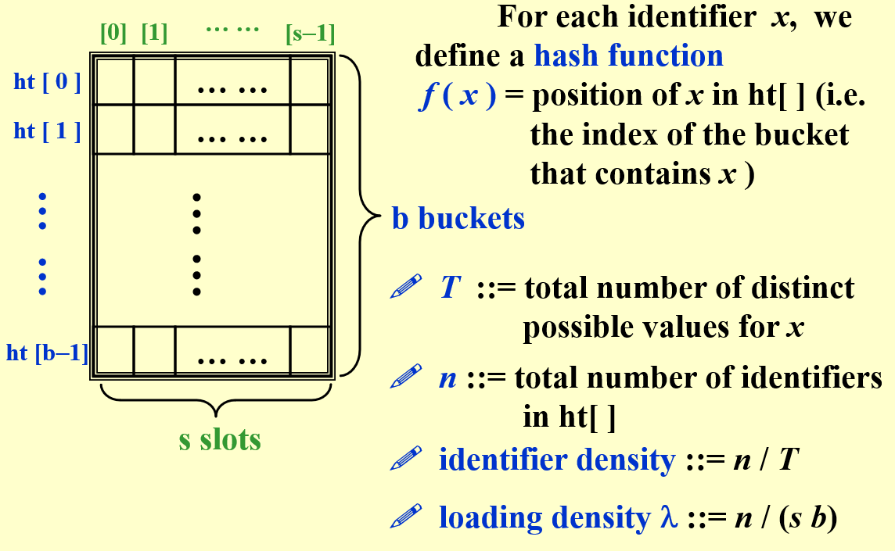

笔记很迷惑 不推荐看
## 一、General Idea
哈希表（Hash Table）：也叫做散列表。是根据关键码值（Key Value）直接进行访问的数据结构。

哈希表通过「键 key 」和「映射函数 Hash(key) 」计算出对应的「值 value」，把关键码值映射到表中一个位置来访问记录，以加快查找的速度。这个映射函数叫做「哈希函数（散列函数）」，存放记录的数组叫做「哈希表（散列表）」。

## 二、Hash Function
1. 简单，且能最小化冲突数
2. 均匀的， That is, for any x and any i, we have that $Probability(f(x)=i)=1/b$
## 三、Separate Chaining
## 四、Open Addressing
### 1. Linear Probing
### 2. Quadratic Probing

!!! NOTE "【Theorem】"
    - If quadratic probing is used, and the table size is prime, then a new element can always be inserted if the table is at least half empty.
### 3.Double Hashing
## 五、Rehashing
Build another table that is about twice as big;
Scan down the entire original hash table for non-deleted elements;
Use a new function to hash those elements into the new table.

## 六、题目
!!! question "The average search time of searching a hash table with N elements is:"
    - A.O(1)
    - B.O(logN)
    - C.O(N)
    - D.cannot be determined
    - D:

!!! question "What is a collision in hashing?"
    - A.Everything else are the same for the two elements except their keys
    - B.Two elements have different data but share the same key
    - C.Two elements with different keys share the same hash value
    - D.Two elements with different hash values share the same key
    - C
 

