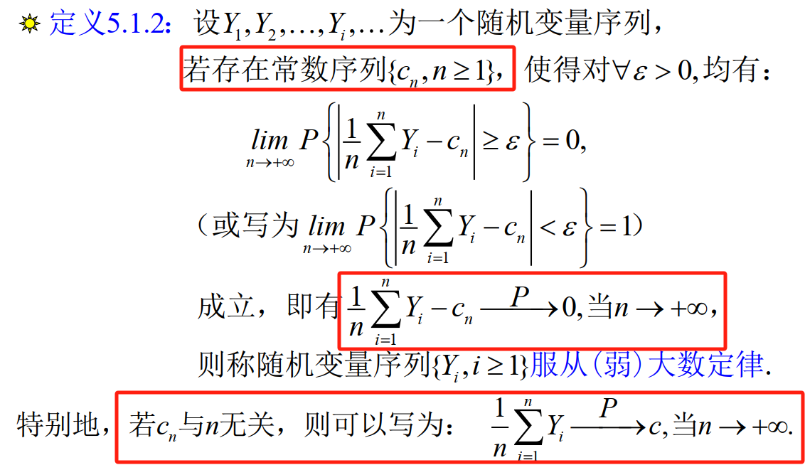

# 一、大数定律
## 1.随机变量序列依概率收敛的定义及性质
### a.定义

·其含义是 “$Y_n$ 对Y的绝对偏差不小于任何一个给定量”的可能性随n的增大而越来越小；或者绝对偏差 $|Y_n-Y|$ 小于任何一个给定量的可能性随n的增大时而越来越接近于1。
### b.性质
强调一个嵌套函数的连续性。

---
## 2.马尔可夫不等式（不考）与切比雪夫不等式
### 马尔可夫不等式
主要讲的是随机变量序列与k阶矩的关系，不在考试范围。
### 切比雪夫不等式

> [!切比雪夫不等式] 切比雪夫不等式
> 设随机变量有数学期望 $E(X)=\mu，Var(X)=\sigma^2,$则对任意 $\epsilon>0$都有
> $$P\{|X-\mu|\geq \epsilon\}\leq \frac{\sigma^2}{\epsilon^2} \quad or\quad P\{|X-\mu|< \epsilon\}\geq 1- \frac{\sigma^2}{\epsilon^2} $$

---

## 3.常见的大数定律
 结论都基本一样，都是说的**随机变量序列的算数平均**依概率收敛到一个稳定值
### 一般的大数定律

### 贝努里大数定律

伯努利大数定律主要说明了大量重复试验中事件出现频率的稳定性，正因为这种稳定性，**概率**的概念才有其意义。
### 辛钦大数定律

还有以下推论，主要是对连续函数的嵌套效果

### 切比雪夫大数定律与马尔可夫大数定律
大数定律的描述（仅作了解）

切比雪夫大数定律特殊情况的应用（需要掌握）

> [!NOTE] 切比雪夫大数定律与辛钦大数定律的区别
> 切比雪夫大数定律的条件：独立+期望、方差相同
> 辛钦大数定律：独立+同分布

---

# 二、中心极限定理
只需要掌握【独立同分布的中心极限定理】和推论【德莫佛-拉普拉斯定理】
## 1.独立同分布的中心极限定理
设随机变量$X_1,X_2,...X_n,...$相互独立且同分布，$E(X_i)=\mu,Var(X_i)=\sigma^2$,那么对于充分大的n，有
$$
 \sum X_i \sim N(n\mu,n\sigma^2)，也可以写\overline{X}=\frac{1}{n}\sum X_i\sim N(\mu,\frac{\sigma^2}{n})
$$
## 2.德莫佛拉普拉斯定理
主要说的是，当n很大的时候，二项分布可以用正态分布去近似（期望与方差不变）直接记：$$n_A \sim N(np,np(1-p))$$