·**总体**：研究对象的全体。
·**个体**：组成总体的每个元素。
总体是某一数量指标的全体，是具有确定分布的随机变量。

·**抽样**：从总体X中抽取有限个个体对总体进行观察的取值过程。
·**随机样本**：随机抽取的n个个体的集合(X1,X2,…,Xn), n为样本容量
·**简单随机样本**：满足以下两个条件的随机样本(X1,X2,…,Xn)称为简单随机样本  
1. 代表性：每个Xi与X同分布
2. 独立性：X1,X2,…,Xn是相互独立的随机变量

·若总体有分布函数$F(x)$，则样本具有联合分布函数$F_n(x_1,x_2,...,x_n)=\prod_{i=1}^n F(x_i)$
·若总体为连续型（或离散型）随机变量，其概率密度函数（或分布律）为$f(x)$，则样本具有联合密度函数（或联合分布律）$f_n(x_1,x_2,...,x_n)=\prod_{i=1}^nf(x_i)$
# 一、统计量
统计量：不含任何未知参数的样本的函数。
·统计量**仍为随机变量**
·统计量的分布（抽样分布）一般与总体分布有关，**可以依赖于未知参数**

·常用的统计量
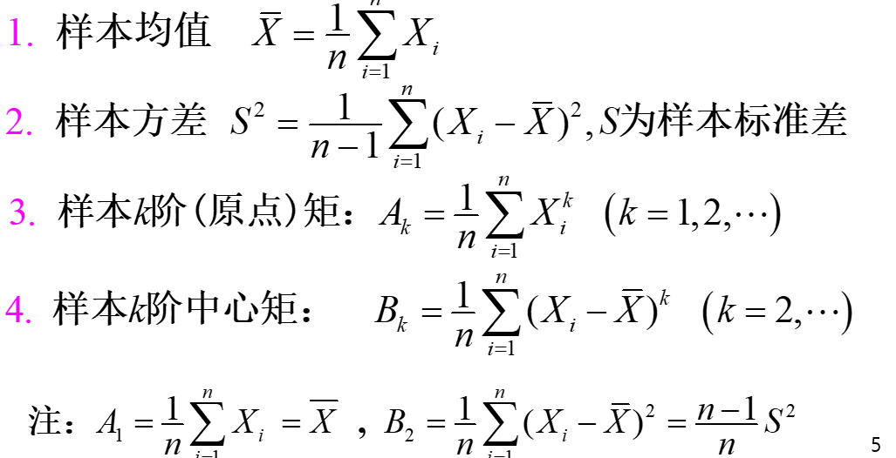
> [!NOTE] **样本均值，样本方差的性质**
> 对总体X，若E(X)=$\mu$，Var(X)=$\sigma^2$,那么$E(\overline{\text{X}})=\mu$，$Var(\overline{\text{X}})=\frac{\sigma^2}{n}$，,$E(S^2)=\sigma^2$

> [!怎么计算S方的方差？] $S^2$的方差？
> $Var(S^2)=\frac{2\sigma^4}{(n-1)}$

$S^2$ 另一种表现方式：样本方差平方项展开后可以化简为
$$
S^2=\frac{1}{n-1}(\sum X_i^2-n\overline{X}^2)
$$
# 二、三大抽样分布
对三大分布，主要掌握
1. 定义
2. 密度图像（密度函数可以不记）——用于求上 $\alpha$ 分位数
3. 相关的性质
## 1.$\chi^2$分布
### (1)定义
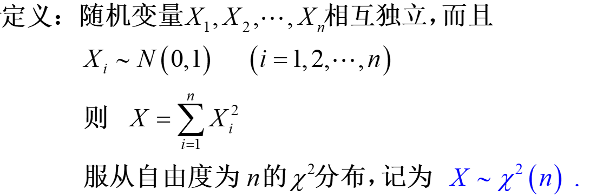
### (2)密度图像
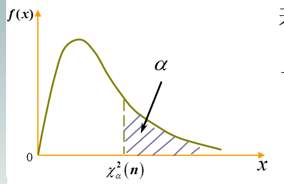
### (3)性质
1. 具有可加性，但要求相互独立
2. $E(X)=n$,$Var(X)=2n$
3. 上 $\alpha$ 分位数性质: n>40时，可以做以下近似： $\chi^2_\alpha(n)=\frac{1}{2} (2\alpha +\sqrt{2n-1})^2$
## 2.t分布
### (1)定义
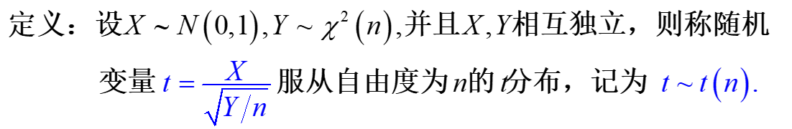
### (2)密度图像
注意t分布服从的参数n与“尾巴”长短的关系：一般来说n越大，整个t分布越“瘦”，尾巴越“塌下来”
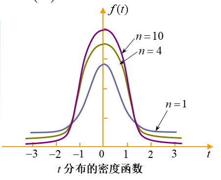
### (3)性质
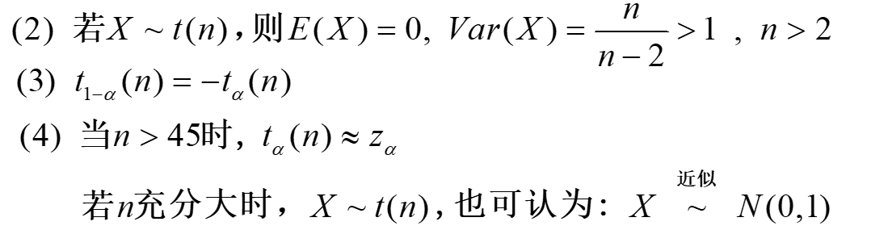
## 3.F分布
### (1)定义
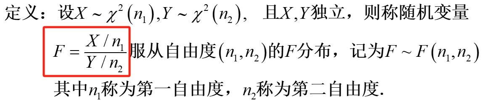
### (2)密度图像
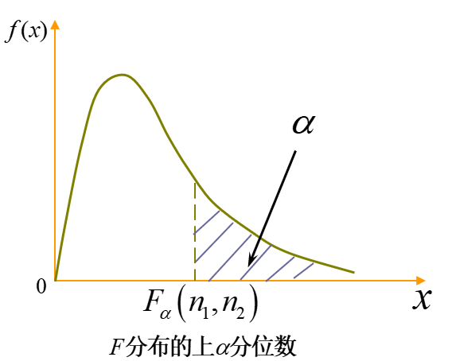
### (3)性质
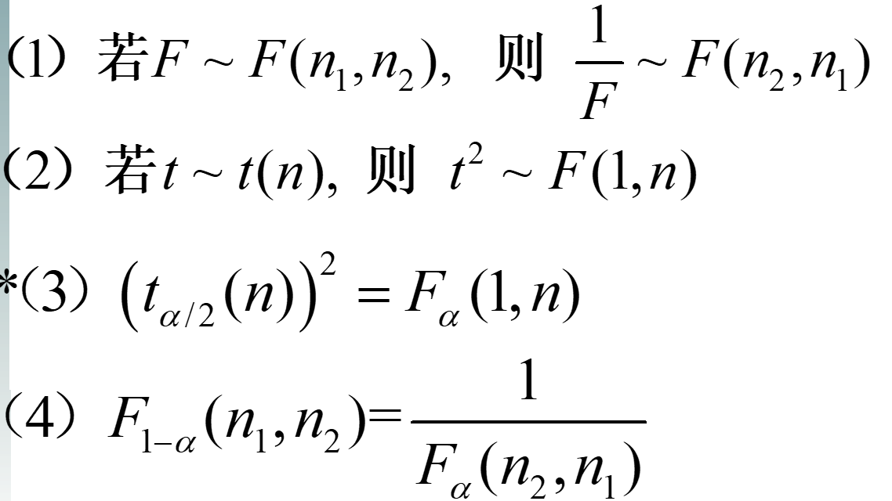
## 4.$\alpha$分位数总结
对正态分布：
$$
\begin{cases}
	z_{1-\alpha}=z_{\alpha}\\
	z_{0.5}=0
\end{cases}
$$
对 $\chi^2$分布：
			一般来说是查表，但n>40时，可以做以下近似： $\chi^2_\alpha(n)=\frac{1}{2} (2\alpha +\sqrt{2n-1})^2$
对t分布：
$$
\begin{cases}
	t_{0.5}(n)=0\\
	t_{1-\alpha}(n)=t_{\alpha}(n)\\
	n>45时，可做近似：t_{\alpha}(n)=z_{\alpha}
\end{cases}
$$
对F分布：
$$\begin{cases}
	(t_{\alpha/2}(n))^2=F_\alpha(1,n)\\
	F_{1-\alpha}(n_1,n_2)=\frac{1}{F_\alpha(n_2,n_1)}——三变法则
\end{cases}$$
# 三、正态总体下的抽样分布
## 1.关于单变量的四个性质
如果x服从正态分布
那么
$$
(1)\frac{\overline{X}-\mu}{\sigma/\sqrt{n}}\sim N(0,1)
$$
$$
(2)\frac{(n-1)S^2}{\sigma^2}\sim \chi^2(n-1)
$$
$$
(3)\frac{\overline{X}-\mu}{S\sqrt{n}}\sim t(n-1)
$$
同时，                                 (4)**$\overline{X}$与 $S^2$独立。
## 2.多变量
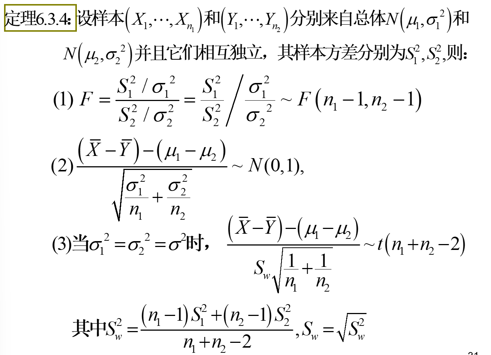

# 四、拓展以下分布
可做一定推导练习，记牢定义
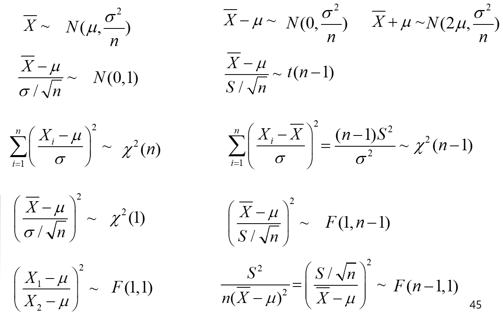
