# 参数估计
## 一 参数的点估计
### 1.矩估计法
思想：用**样本矩**去估计相应的**总体矩**
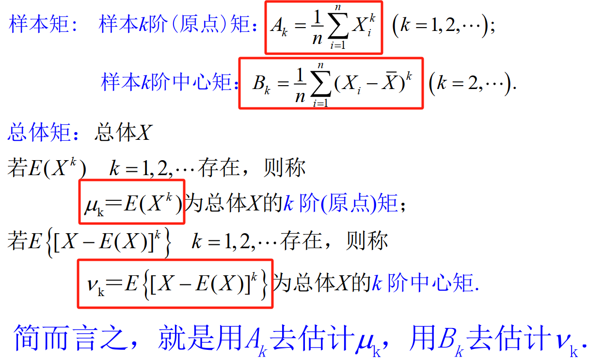
### 2.极大似然估计法
（1）对离散随机变量，构造似然函数$L(\theta)=P \{X_1=x_1,...,X_n=x_n\}=\Pi p(x_i;\theta)$  
（2）求似然函数最大时的变量的值，这时未知变量就用所用样本值表示，连续分布的同理。

!!! note "求解$\theta$时"
	- 在求L的最大值的时候，通常采取取对数的形式。
	- 若L为一个单调的函数，那么最大似然估计在左右边界处取得。通常会用x(1)与x(n)来表示。x(1)表示X1-Xn中的足最小值，x(n)表示最大值。

· **极大似然估计的不变性：**   
	套连续函数g仍旧成立。
	设参数 $\theta$ 的极大似然估计为 $\hat{\theta}$ ,若 $g(·)$ 为连续函数，则 $g(\theta)$ 的极大似然估计为 $g(\hat{\theta})$
---
## 二 估计量的评价准则
### 1.无偏性准则
如果参数的估计量的期望值等于估计量，那么是无偏估计量。
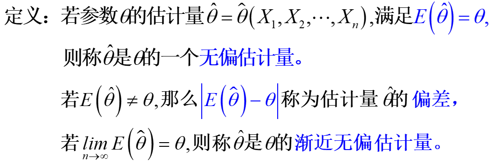

!!! note "无偏估计结论"
	- 设总体X的一阶矩和二阶矩均存在，分布是任意的。  
	则对总体X，若E(X)=$\mu$，Var(X)=$\sigma^2$,样本均值 $\overline{X}$和样本方差 $S^2$$分别是$ $\mu$ ,$\sigma^2$的无偏估计。
!!! note "纠偏方法"
	- 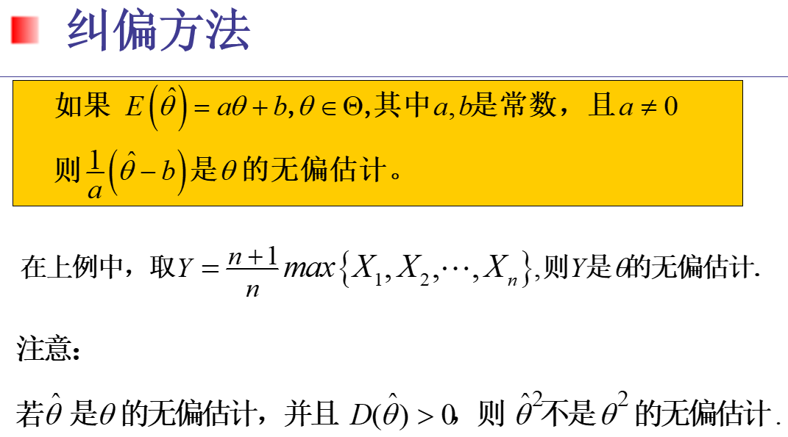

---
### 2.有效性准则
对于两个**无偏估计**，衡量他们的方差
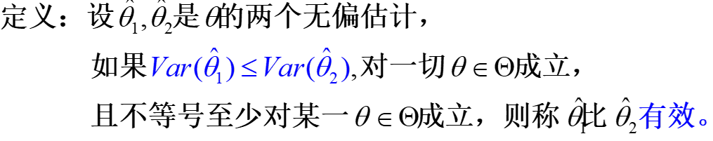
### 3.均方误差准则
引入均方差MSE，在实际应用中，**均方误差准则比无偏性准则更重要。**
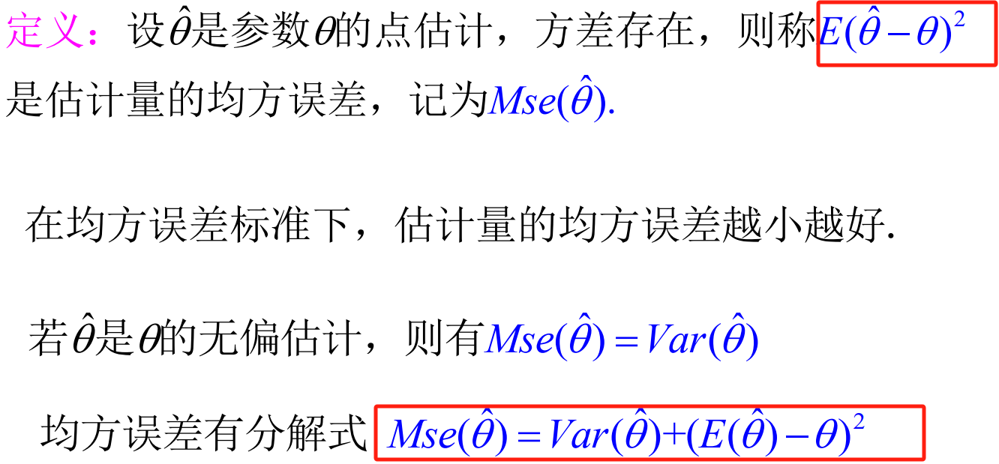
### 4.相合性准则
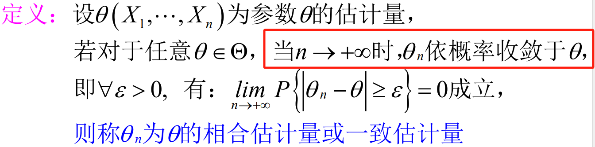
一般用切比雪夫不等式或大数律验证，有时还需结合依概率收敛的性质。

---
## 三 区间估计
### 1.置信区间的定义
#### 双侧置信区间
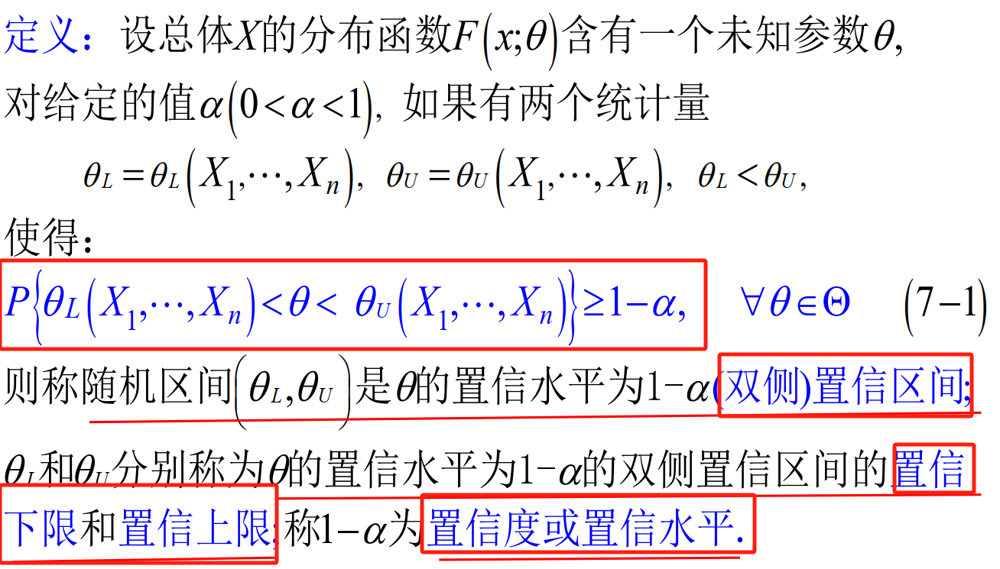
#### 单侧置信区间
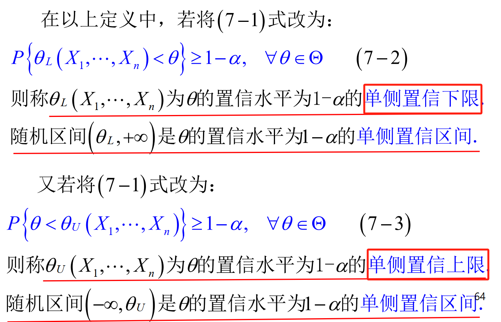
#### 双侧、 单侧置信区间的关系
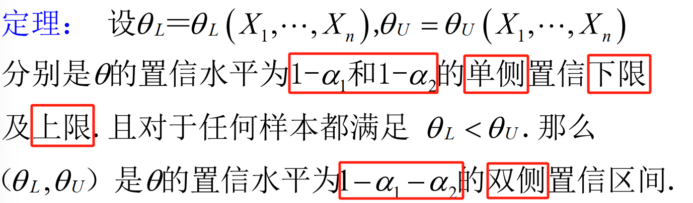
### 2.区间估计的评价原则
**置信度原则**：随机区间包含真值的概率越大越好  
**精确度原则**：精确度可用随机区间$(\theta_L,\theta_U )$的平均长度去衡量， $即E(\theta_U-\theta_L)$越短越好  
**误差限：** 二分之一区间的平均长度  

现实应用中，我们通常希望在保证置信度的前提下，尽可能提高精确度
### 3.寻找区间估计的方法-枢轴量法
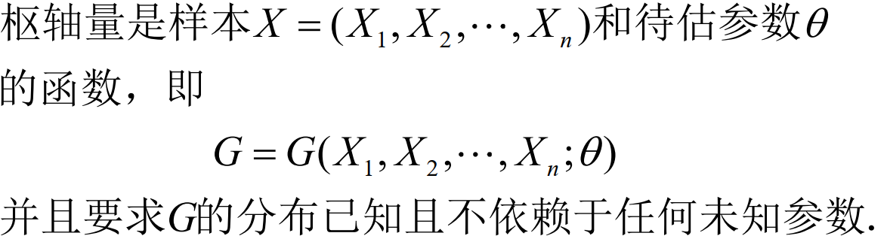
#### 步骤
1. 找枢轴量G，同时写出它的分布
2. 根据给定的置信度 $1-\alpha$ 找到常数a,b使得枢轴量G在ab之间的概率为 $1-\alpha$ 
3. 得到等价的不等式，找到$(\theta_L,\theta_U )$

·注意，一般来说求双侧置信区间的时候 $\alpha$要除以2，求单侧的时候不需要。

!!! note "枢轴量和统计量的区别："
	- 枢轴量是样本和待估参数的函数，其分布不依赖于任何未知参数
	- 统计量只是样本的函数，其分布常依赖于未知参数

**同等置信区间：** 如果第二步中是取等号得到的，那么这个置信区间也为同等置信区间。

#### 取值原则
1. Neyman 原则： 求a和b使得区间平均长度最短；
2. 等尾置信区间：如果最优解不存在或比较复杂， 为应用的方便，常取a和b满足:

$$
P(G(X;\theta)\leq a )=P(G(X;\theta)\geq b )=\alpha/2
$$
---
## 四 正态总体参数的区间估计
### 1.单个正态总体的情形-$估计\mu$
#### (1) $\sigma^2$已知
取枢轴量

$$
\frac{\overline{X}-\mu}{\sigma\sqrt{n}}\sim N(0,1)
$$

置信区间为

$$
(\overline{X}-\frac{\sigma}{\sqrt{n}}z_{\alpha/2},\overline{X}+\frac{\sigma}{\sqrt{n}}z_{\alpha/2} )
$$

此时区间的平均长度为

$$
\frac{2\sigma}{\sqrt{n}}z_{\alpha/2}
$$
#### (2) $\sigma^2$未知
取枢轴量

$$
\frac{\overline{X}-\mu}{S/\sqrt{n}}\sim t(n-1)
$$

置信区间为

$$
(\overline{X}-\frac{S}{\sqrt{n}}t_{\alpha/2}(n-1),\overline{X}+\frac{S}{\sqrt{n}}t_{\alpha/2}(n-1) )
$$
此时区间的平均长度为

$$
\frac{2S}{\sqrt{n}}t_{\alpha/2}(n-1)
$$
### 2.单个正态总体的情形-$估计\sigma^2$
#### (1)$\mu$未知
取枢轴量

$$
\frac{(n-1)S^2}{\sigma^2}\sim \chi^2(n-1)
$$
---
### 3.两个正态总体的情形
#### （1）$估计\mu_1-\mu_2$
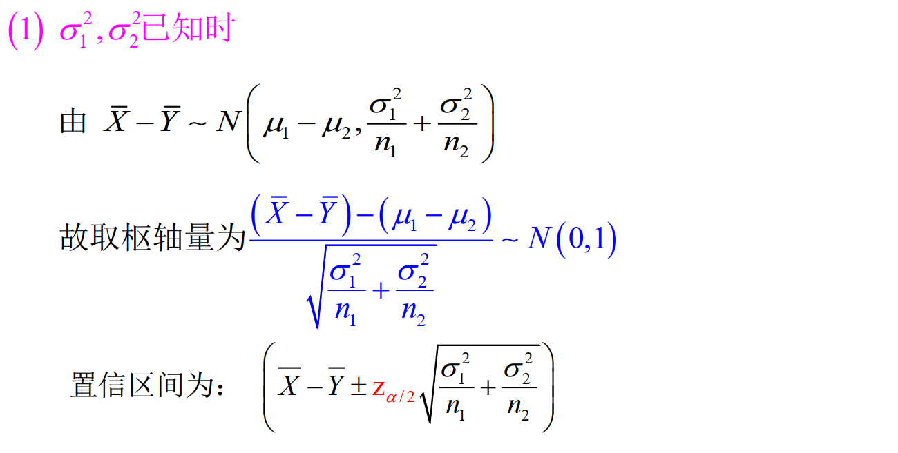
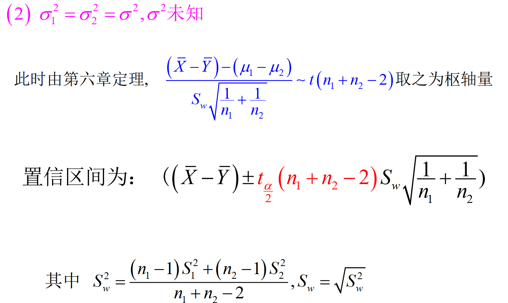
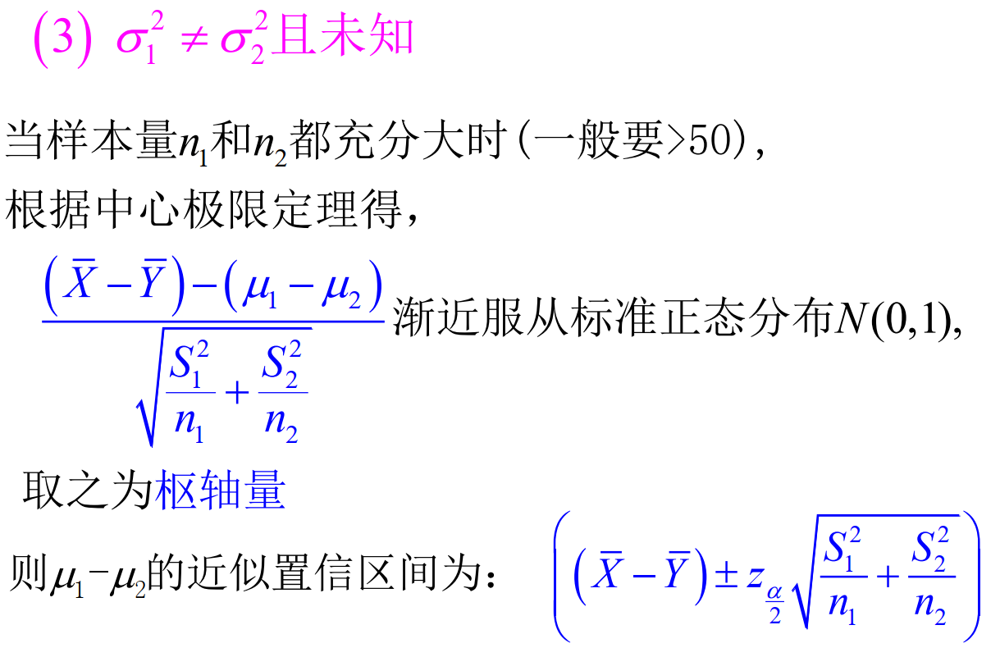
样本量小的时候，仍取枢轴量 

$$\frac{(\overline{X}-\overline{Y})-(\mu_1-\mu_2)}{\sqrt{\frac{s_1^2}{n_1}+\frac{s_2^2}{n_2}}}$$

可以证明它近似服从于自由度为k的t分布，常让k=$min(n1-1,n2-1)$
#### （2）$估计\frac{\sigma_1^2}{\sigma_2^2}$
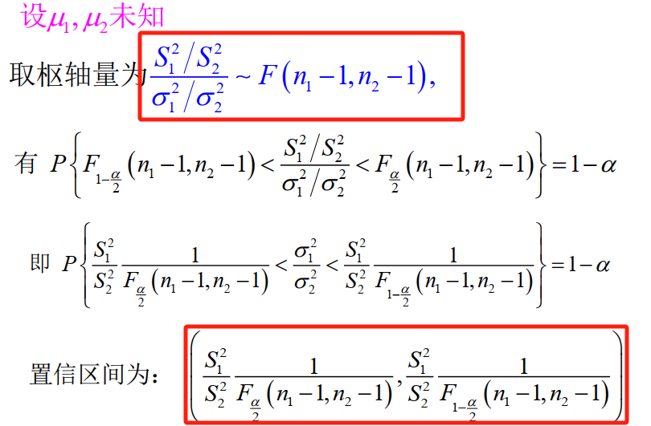

---
### 4.参数区间估计汇总表
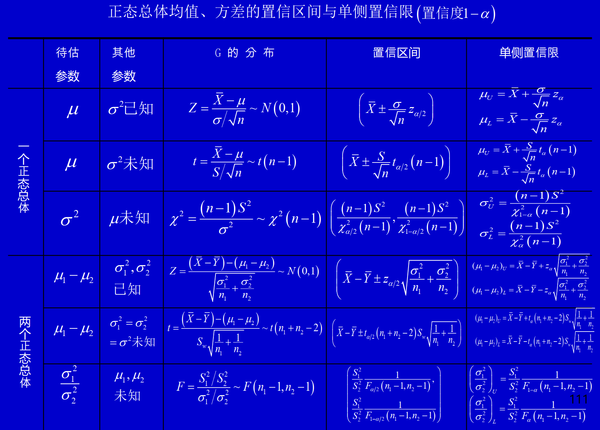

---
## 五、非正态总体参数的区间估计
求的是近似置信区间，我们需要想到中心极限定理。通常把非正态分布根据中心极限定理近似成一个正态分布，构造枢轴量求解置信区间。
