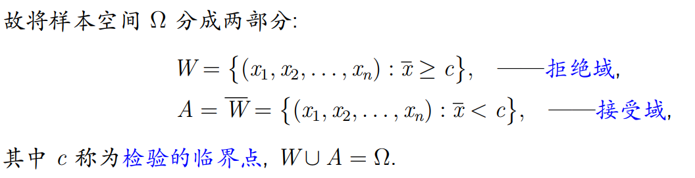
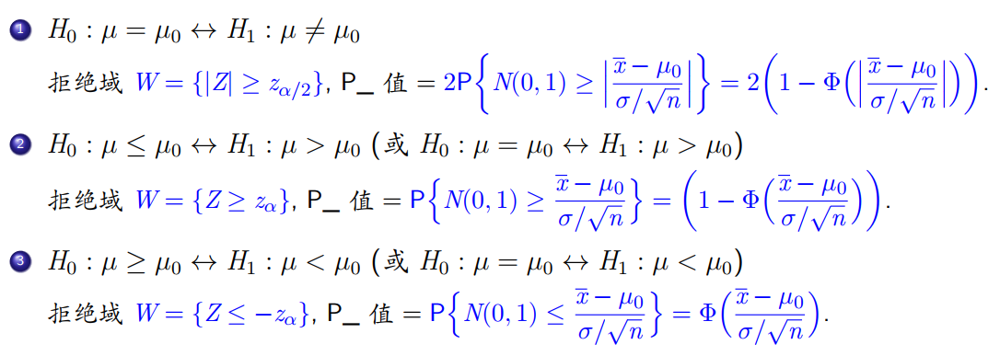

不考范围：
估计均值（两个正态方差不等）的假设检验  

8.6 列联表的独立性检验
## 一、假设检验的基本思路
### 1.概念
#### (1)假设
先对总体参数、分布形式等作出**某种假设**, 然后利用**样本信息来判断该假设是否合理。**  

我们建立两个观点，一个作为原假设（零假设）H0，一个作为备择假设（对立假设）H1

!!! tip "H0与H1的关系"
	- H0和H1一定不相容，但不一定互补.
	- H0是不容易被否定的，对于一定的立场下不可以互换。
	- 通常来说，通过样本提出的疑问对应的观点经常被列为H1

!!! note "**参数假设检验**和**非参数假设检验**之分"
	- 参数假设是指对总体分布中的未知参数作假设，除此之外其他的假设均为非参数假设  
	- 对于参数检验假设，分为简单假设（假设空间为单元素集）和复杂假设
#### (2)检验
检验就是给出一个规则，由这个规则我们最终判断是否接受H0  

这个规则的划分用到的统计量就是检验统计量   

拒绝域和接受域的定义，临界点的定义  

#### (3)两类错误
弃真/取伪
弃真概率 $\alpha(\theta)$,取伪概率 $\beta(\theta)$
!!! note "两类错误概率之间的关系"
	- 当n固定的时候，α越大，β越小
#### (4)显著性水平为α的检验

!!! note "拒绝H0，表明检验的效果是显著的"
---
### 2.假设检验的步骤
#### (1)建立假设
建立H0和H1，我们的任务就是通过样本来做出“保留H0”还是“拒绝H0”的推断
#### (2)构造检验统计量
先假定H0为真，然后利用样本判断其真伪
由于样本所含的信息分散，所以要构造统计量来进行判断，即**检验估计量**
#### (3)确定拒绝域和接受域

#### (4)根据给定的显著性水平来确定临界点
我们用**显著性水平 $\alpha$** 来衡量我们做"H0是否为真“的判断时犯错误的概率，要求这个概率为

$$
P(H_0被拒绝|H_0为真)\leq \alpha
$$

通常我们确定临界点的时候，使等号取等。
#### (5)做判断
样本落入拒绝域，则拒绝；落入接受域，则接受
## 二、正态分布总体下参数的假设检验
!!! warning "注意！！！！"
	- 下方所写的 ~ 都是建立在H0为真的情况下，考试的时候要在波浪线上方多写一个H0为真
### 1.单个正态总体
#### (1)检验μ
若$\sigma^2 已知:Z检验法$  

检验统计量用

$$
Z=\frac{\overline{X}-\mu_0}{\sigma/\sqrt{n}}\sim^{H0为真}  N(0,1)
$$

找到什么时候，Z满足拒绝域的条件（H1的条件），注意检验不等的时候要用等尾处理

---
若$\sigma^2 未知:$t检验法  

检验统计量用

$$
t=\frac{\overline{X}-\mu_0}{S/\sqrt{n}}\sim^{H0为真}  t(n-1)
$$

确定检验规则的方法同上，最后结果三条

$$
\begin{cases}
	t\leq -t_\alpha(n-1)\\
	t\geq t_\alpha(n-1)\\
	|t|\geq t_{\alpha/2}(n-1)
\end{cases}
$$
---
#### (2)正态总体方差的假设检验(已知 $\sigma_0$ )
若已知 $\mu$，用 $\chi^2$检验  

取检验统计量

$$
\chi^2=\frac{1}{n}\sum_{i=1}^n(X_i-\mu)^2\sim^{H0为真}  \chi^2(n)
$$

确定检验规则的方法同上，最后结果三条

$$
\begin{cases}
	\chi^2\leq \chi^2_{1-\alpha}(n)\\
	\chi^2\geq \chi^2_{\alpha}(n))\\
	\chi^2 \geq \chi^2_{\alpha/2}(n) \quad or\quad  \chi^2 \leq \chi^2_{1-\alpha/2}(n)  
\end{cases}
$$
---
若未知 $\mu$，也是用 $\chi^2$检验，但是自由度变化了

因为取的检验统计量为

$$
\chi^2=\frac{\sum_{i=1}^n(X_i-\mu)^2}{\sigma_0^2}\sim^{H0为真} \chi^2(n-1)
$$

确定检验规则的方法同上，最后结果三条

$$
\begin{cases}
	\chi^2\leq \chi^2_{1-\alpha}(n-1)\\
	\chi^2\geq \chi^2_{\alpha}(n-1)\\
	\chi^2 \geq \chi^2_{\alpha/2}(n-1) \quad or\quad  \chi^2 \leq \chi^2_{1-\alpha/2}(n-1)  
\end{cases}
$$

---
### 2.两个正态总体
两个正态整体来自 $N(\mu_1,\sigma^2_2)$,$N(\mu_1,\sigma^2_2)$,分别取了n1和n2个
#### (1)检验 $\mu_1-\mu_2与\delta$的关系 
$\sigma^2_X和\sigma^2_Y$已知，令 $\mu_1-\mu_2=\delta$  

注意到 $\overline{X}-\overline{Y}\sim N(\mu_1-\mu_2,\sigma^2_1/n_1+\sigma^2_2/n_2)$  

我们可取

$$Z=\frac{\overline{X}-\overline{Y}-\delta}{\sqrt{\sigma^2_1/n_1+\sigma^2_2/n_2}}\sim^{H0为真}  N(0,1)$$

三类拒绝域：

$$
\begin{cases}
	z\leq -z_\alpha\\
	z\geq z_\alpha\\
	|z|\geq z_{\alpha/2}
\end{cases}
$$
---
$\sigma^2_X和\sigma^2_Y$未知时，只考$\sigma^2_X=\sigma^2_Y=\sigma^2$  

取检验统计量

$$
t=\frac{\overline{X}-\overline{Y}-\delta}{S_w\sqrt{\frac{1}{n_1}+\frac{1}{n_2}}}\sim^{H0为真}  t(n_1+n_2-2)
$$
这里 $S_w=\sqrt{\frac{(n_1-1)S_1^2+(n_2-1)S_2^2}{n_1+n_2-2}}$  

三类拒绝域

$$
\begin{cases}
	t\leq -t_\alpha(n_1+n_2-2)\\
	t\geq t_\alpha(n_1+n_2-2)\\
	|t|\geq t_{\alpha/2}(n_1+n_2-2)
\end{cases}
$$
---
#### (2)比较 $\sigma_1^2与\sigma_2^2$
$\mu_1和\mu_2$未知  

取检验统计量

$$F=\frac{\frac{(n_1-1)S_1^2}{\sigma^2_1}/(n_1-1)}{\frac{(n_2-1)S_2^2}{\sigma^2_2}/(n_2-1)}=\frac{S_1^2}{S_2^2}\sim^{H0为真} F(n_1-1,n_2-1)$$

三类拒绝域

$$
\begin{cases}
	F\leq F_{1-\alpha}(n_1-1,n_2-1)\\
	F\geq F_\alpha(n_1-1,n_2-1)\\
	F\geq F_{\alpha/2}(n_1-1,n_2-1)\quad or \quad F\leq F_{1-\alpha/2}(n_1-1,n_2-1)
\end{cases}
$$
---
$\mu_1和\mu_2$已知  

取检验统计量

$$F=\frac{\sum_{i=1}^{n_1}(X_i-\mu_1)^2/n_1}{\sum_{i=1}^{n_2}(Y_i-\mu_2)^2/n_2}\sim^{H0为真} F(n_1,n_2)$$

三类拒绝域

$$
\begin{cases}
	F\leq F_{1-\alpha}(n_1,n_2)\\
	F\geq F_\alpha(n_1,n_2)\\
	F\geq F_{\alpha/2}(n_1,n_2)\quad or \quad F\leq F_{1-\alpha/2}(n_1,n_2)
\end{cases}
$$
----
汇总

## 三、P值
对于同一个样本组进行分析，不同的显著性水平 $\alpha$ 可能会得到不同的结论，引入p值来与 $\alpha$ 进行更直观的比较。

!!! quote "P值的定义"	
	- 当原假设成立时，检验统计量 取 比观察到的结果更极端的的数值 的概率。
	- 如果 $p\leq \alpha$那么在显著性水平 $\alpha$下拒绝H0
	- 如果 $p\geq \alpha$那么在显著性水平 $\alpha$下保留H0

---
对上述四类单个正态总体的P值总结如下:  

若$\sigma^2 已知:Z检验法$  

检验统计量用

$$
Z=\frac{\overline{X}-\mu_0}{\sigma/\sqrt{n}}\sim^{H0为真}  N(0,1)
$$

---
若$\sigma^2 未知:$t检验法  

检验统计量用

$$
t=\frac{\overline{X}-\mu_0}{S/\sqrt{n}}\sim^{H0为真}  t(n-1)
$$

---
若已知 $\mu$，用 $\chi^2$检验  

取检验统计量

$$
\chi^2=\frac{1}{n}\sum_{i=1}^n(X_i-\mu)^2\sim^{H0为真}  \chi^2(n)
$$

$$
\begin{cases}
	2P\{\chi^2(n)\leq\frac{1}{n}\sum_{i=1}^n(X_i-\mu)^2 \} \quad or \quad 2P\{\chi^2(n)\geq\frac{1}{n}\sum_{i=1}^n(X_i-\mu)^2 \} \\
	P\{\chi^2(n)\geq\frac{1}{n}\sum_{i=1}^n(X_i-\mu)^2 \} \\
	P\{\chi^2(n)\leq\frac{1}{n}\sum_{i=1}^n(X_i-\mu)^2 \} 
\end{cases}
$$
---
若未知 $\mu$，也是用 $\chi^2$检验，但是自由度变化了  

因为取的检验统计量为

$$\chi^2=\frac{\sum_{i=1}^n(X_i-\mu)^2}{\sigma_0^2}\sim^{H0为真} \chi^2(n-1)$$

## 四、假设检验与区间估计
对于置信度 $1-\alpha$，显著性水平 $\alpha$，一般来说置信区间里的都是接受域，置信区间外的都是拒绝域
## 五、拟合优度检验
实际问题中需要我们直接对总体分布做出一个假设。
### 1.皮尔逊拟合优度 $\chi^2$ 检验
#### 原理
1. 从总体中取得样本容量为n的样本，将其分成k个两两不相交的子集A1...Ak，$要检验的是 $H_0：P(A_i)=p_i,i=1,2,...k$
2. 用 $n_i$ 记录样本值 $x_i$ 落在 $A_i$的个数，则在n次实验中$A_i$发生的频率为$\frac{n_i}{n}$
3. 如果原假设H0成立，那么实测频数 $n_i$与 理论频数 $np_i$相差不大
4. 引入 $\chi^2=\sum^{k}_{i=1}\frac{(n_i-np_i)^2}{np_i}$
5. 有定理：·若原假设成立，那么 $\chi^2$渐进服从于自由度k-1的 $\chi^2$分布
6. 拒绝域 $W=\{  \chi^2 \geq C  \}$, $C=\chi^2_\alpha(k-1)$
7. 或者用P值 $P\_=P\{\chi^2(k-1)\geq \chi^2 观测值 \}$是否大于显著性水平
8. 如果式子中存在未知的参数，用样本求出该参数的极大似然估计作为参数值。
9. 如果原假设中有r个未知参数，那么对应的自由度还要-r