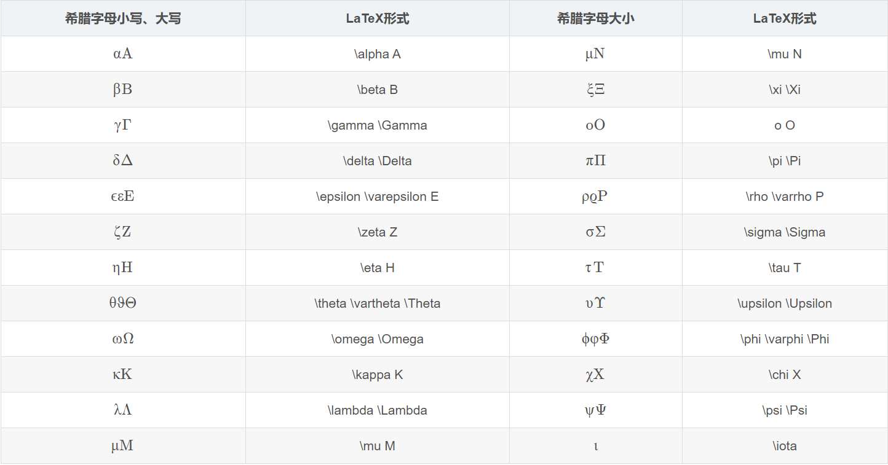

# Building your website
## 如何搭建你的网站
推荐一下CCnoccc搭建网站的writeup:[CCnocc's writeup](https://zjuccnocc.github.io/BlogWriteup/Mkdocs%E4%BD%BF%E7%94%A8Writeup/)

关于material主题的配置问题，可以参考[Setup](https://squidfunk.github.io/mkdocs-material/setup/)
## 记录python-markdown拓展使用
参考文献[python-markdown语法](https://blog.csdn.net/P_LarT/article/details/55819896?ops_request_misc=&request_id=&biz_id=102&utm_term=python%20markdown&utm_medium=distribute.pc_search_result.none-task-blog-2~all~sobaiduweb~default-4-55819896.nonecase&spm=1018.2226.3001.4187),[一些整合](https://facelessuser.github.io/pymdown-extensions/extensions/mark/)总结一些较为好用的格式。

```text title="Python-Markdown拓展库"
Extension               “Name”
Extra                   markdown.extensions.extra
    Abbreviations       markdown.extensions.abbr
    Attribute Lists     markdown.extensions.attr_list
    Definition Lists    markdown.extensions.def_list
    Fenced Code Blocks  markdown.extensions.fenced_code
    Footnotes           markdown.extensions.footnotes
    Tables              markdown.extensions.tables
    Smart Strong        markdown.extensions.smart_strong
Admonition              markdown.extensions.admonition
CodeHilite              markdown.extensions.codehilite
HeaderId                markdown.extensions.headerid
Meta-Data               markdown.extensions.meta
New Line to Break       markdown.extensions.nl2br
Sane Lists              markdown.extensions.sane_lists
SmartyPants             markdown.extensions.smarty
Table of Contents       markdown.extensions.toc
WikiLinks               markdown.extensions.wikilinks
```
### Extra
#### abbreviation缩写功能
```text title="格式"
==============
*[]:----------
```

#### def_list定义列表
```text title="格式"
===
: --------

===
: --------
```

#### footnotes脚注
如果你需要一个脚注[^xxxx]
[^xxxx]: 这是你需要的脚注

```text title="格式"
如果你需要一个脚注[^xxxx]
[^xxxx]: 这是你需要的脚注
```

### Admonition 警告
```text title="格式"
!!! type "name"
    content
```

!!! note 
    content
!!! abstract
    content
!!! info
    content 
!!! tip
    content 
!!! success
    content 
!!! question
    content 
!!! quote
    content
!!! example
    content
!!! warning
    content 
!!! danger 
    content 
!!! failure
    content 
!!! bug
    content 
    
### Details 折叠页
```text title="格式"
??? type "name"
    content
```
??? note 
    content


### Tabbed 标签

```text title="格式（内部可以镶嵌代码块、列表等）"
=== "name1"
    content1

=== "name2"
    content2
```

效果如下：
=== "name1"
    content1

=== "name2"
    content2

如果需要同时创建多个Tab，需要在第二个Tab的第一个===后面加上！

### Task List 任务列表
```text title="格式"
Task List

-   [X] item 1
    *   [X] item A
    *   [ ] item B
        more text
        +   [x] item a
        +   [ ] item b
        +   [x] item c
    *   [X] item C
-   [ ] item 2
-   [ ] item 3
```
Task List

-   [X] item 1
    *   [X] item A
    *   [ ] item B
        more text
        +   [x] item a
        +   [ ] item b
        +   [x] item c
    *   [X] item C
-   [ ] item 2
-   [ ] item 3

## Markdown好用格式
### 块
>   \>呈现一个块
>>支持嵌套

    Tab呈现块
        也支持多级
### 列表
有序无序列表混搭

1. Ordered item 1
2. Ordered item 2

- Unordered item 1
- Unordered item 2
## 希腊字母表   


