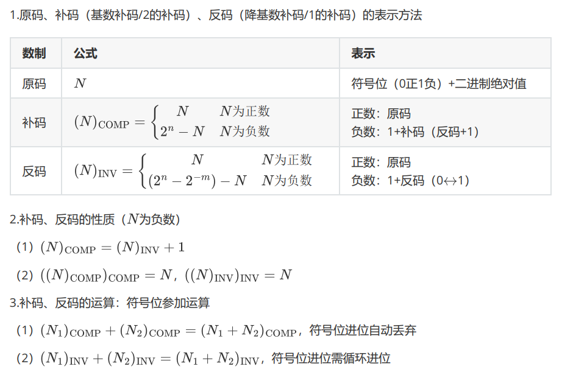

## 一、数制与码制
### 1.二进制算数运算

### 2.常用编码
8421 BCD
: 将每一位十进制数字都用普通4位二进制表示

2421 BCD
: 将每一位十进制数字都用2，4，2，1的权重展开，0＝0000 1＝0001 2＝0010 3＝0011 4＝0100 5＝1011 6＝1100 7＝1101 8＝1110 9＝1111。2421码的禁止码是0101、0110、0111、1000、1001、1010。
	这使得2421具有一个特点：和为9的数互为反码，便于减法（便于对9求补）

余3码
: 每一位数字相当于8421码加上0011
	使得余3码有一个特点：和为9的数互为反码，便于减法

格雷码：
: 相邻码组仅有一位状态不同
	1. 二进制转格雷码：最高位不变，低位为高位二进制和本位二进制异或
	2. 格雷码转二进制：最高位不变，低位为本位格雷码和高位二进制异或

余3循环码
: 余三循环码就是余三码通过**格雷码**的异或运算，所得到的一系列变权码。

### 3.二进制的补码运算

!!! question "为什么要用二进制补码相加？"
	不仅电路结构简单，而且运算可以一步完成。

解题步骤：

1. 将两个带符号的数的绝对值相加，判断需要几位补码。
2. 将两个数写成补码的形式
3. 将这两个补码按二进制加法相加，得到补码形式的和。
	- 和的形式仍为补码
4. 符号位和来自于数值部分的进位相加，结果就是和的符号位。

## 二、逻辑代数基础
### 1.逻辑代数公式、定理
#### 公式
$$
\begin{align}
A+B\cdot C&=(A+B)\cdot(A+C)\\
A+A\cdot B&=A\\
A+\overline{A}\cdot B&=A+B\\
A\cdot (\overline{A}+B)&=A\cdot B\\
A\cdot B+\overline{A}\cdot C+B\cdot C&=A\cdot B+\overline{A}\cdot C\\
(A+B)(\overline{A}+C)(B+C)&=(A+B)(\overline{A}+C)
\end{align}
$$
#### 基本定理
（1）代入定理：在任何一个包含变量 $A$ 的逻辑等式中，若以另外一个逻辑式代入式中所有 $A$ 的位置，则等式仍然成立。

（2）反演定理：取反时，与或互换，0 1互换，原反互换，由外而内。
### 2.逻辑函数描述方法
真值表、逻辑式、逻辑图、波形图、卡诺图
### 3.逻辑函数标准形式
最小项
: $Y(A,B,C,D)=\sum m(m_1,m_2,\dots,m_n)$      $m$ 为乘积项
所有最小项之和为 1 ，任意两个最小项之积为 0

最大项
: $Y(A,B,C,D)=\prod M(M_1,M_2,\dots,M_n)$     $M$ 为和项
所有最大项之积为 0 ，任意两个最大项之和为 1

最小项与最大项的关系
: $\sum m_i=\prod M_k\qquad i\neq k$       即互为对偶式
#### 逻辑式的变换
1. **与或**，使用卡诺图进行化简
2. **与非**，由与或进行两次求反
3. **与或非**，使用卡诺图对0求和，再求反
4. **或与**，展开“与或非”
5. **或非**，将“与或非”内部化为或非形式
6. 转化为最小项：乘(A+A')
7. 转化为最大项：加(A+A')
### 4.逻辑函数的化简
1. 公式
2. 卡诺图
3. 具有无关项的逻辑函数化简

!!! NOTE "约束项、任意项和无关项？"
	**约束项**：逻辑函数工作过程中，约束项的值永远是0，即取值情况永远不会取到约束项相关的情况。
	
	**任意项**：在某些变量的取值情况下，逻辑函数值等于1还是等于0，对电路的逻辑功能都没有影响，在这些变量取值情况下等于1的那些最小项，就是任意项。
		- 在化简时，可写可不写。

	**无关项**：上述二者都是无关项，但是二者有区别：约束项永远是0，所以逻辑函数中无论是有还是没有约束项，结果都一样；任意项会存在1的情况，在逻辑表达式中写入任意项后，任意项为1时，函数输出也为，如果拿掉任意项，任意项为1时，函数值为0.

