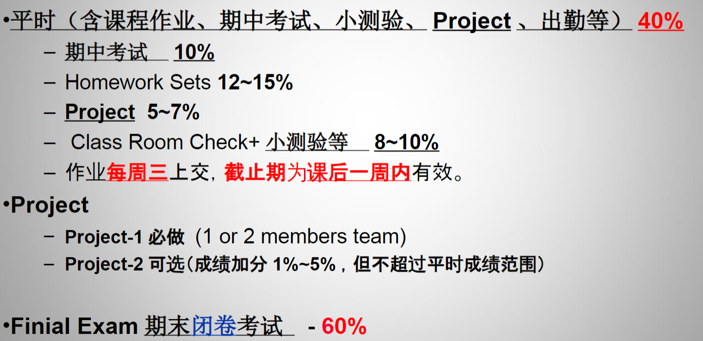

# 数字系统设计
!!! quote "@腊八粥"
    - 课程内容编码开始（要自己看），然后是基本的逻辑化简和卡诺图，再到两个大头组合逻辑和时序逻辑，然后再是控制器的设计，还有一些微处理器、测试、硬件语言相关的知识。内容整体上还是比较连贯的，从头学到尾其实不会有比较大的障碍，如果平时每周把知识点搞明白的话考试周甚至会比较轻松（只要刷刷熟练度就可以了）。因为数电期末考试占大头，而且考的比较灵活，每年的考试范围也都不一样，所以会导致复习的过程中感觉很迷，历年卷做到怀疑人生，这个我感觉比较难克服，只能尽可能找老师把考试范围问问清楚。

!!! info "课程信息"
    - 授课教师：王维东
    - 使用教材：阎石《数字电子技术基础》
    - 成绩组成：
    - !!! info "课程结构"
        - 数字理论知识(必备)
            - 数字系统和编码、逻辑代数、门电路
        - 数字电路分析与设计
            - 组合逻辑电路–触发器、半导体存贮器、可编程器件
            - 时序逻辑电路
        - 脉冲电路与接口
        - 控制器与数字系统
            - 状态机
            - 控制器
            - 微码控制器
            - 测试和验证
        - 微处理器简介与设计
            - 指令集
            - 4位CPU设计
!!! note "课程资源"
    - [学在浙大](https://courses.zju.edu.cn/course/69700/content#/)
        
