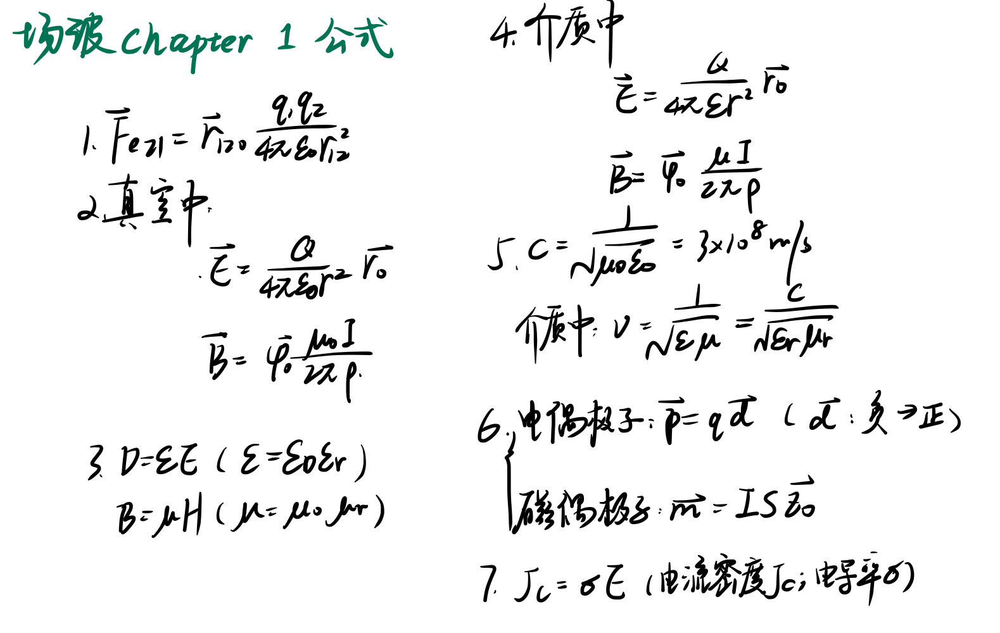
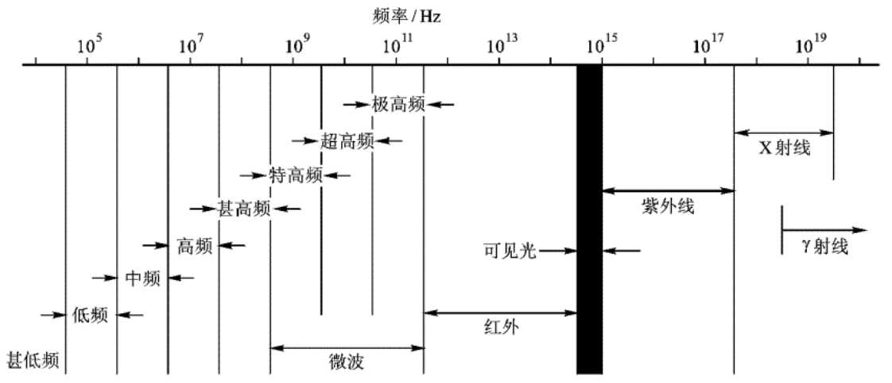
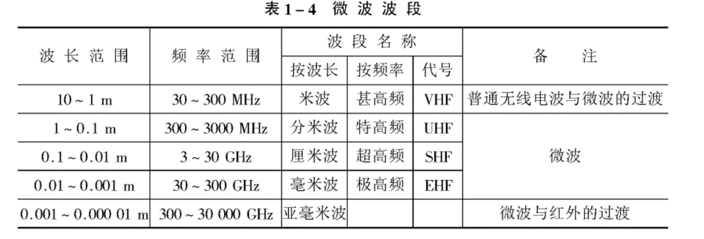
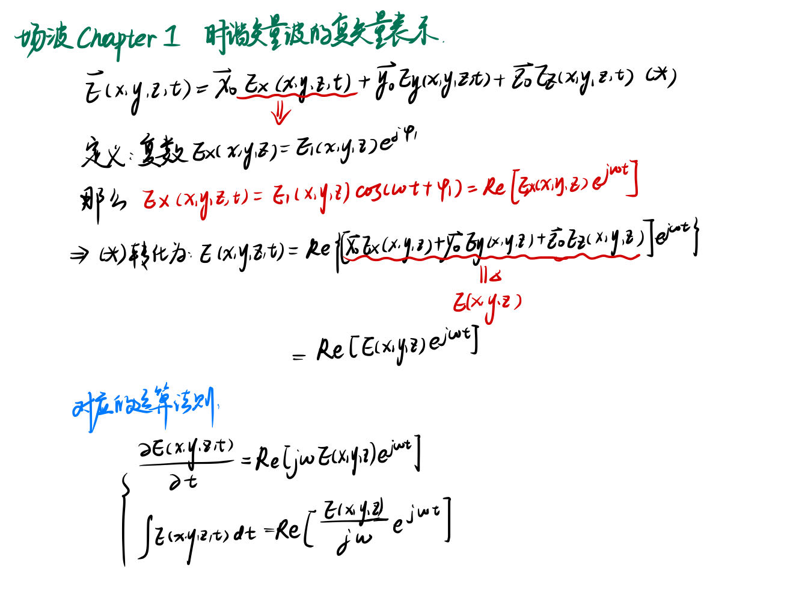
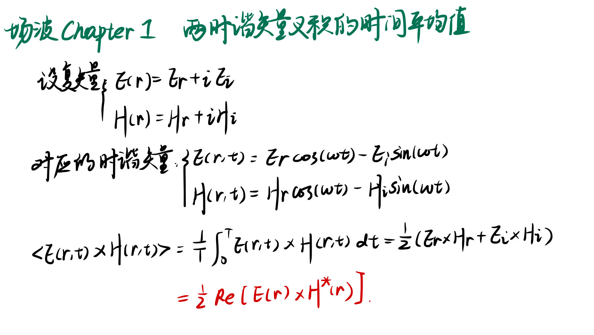
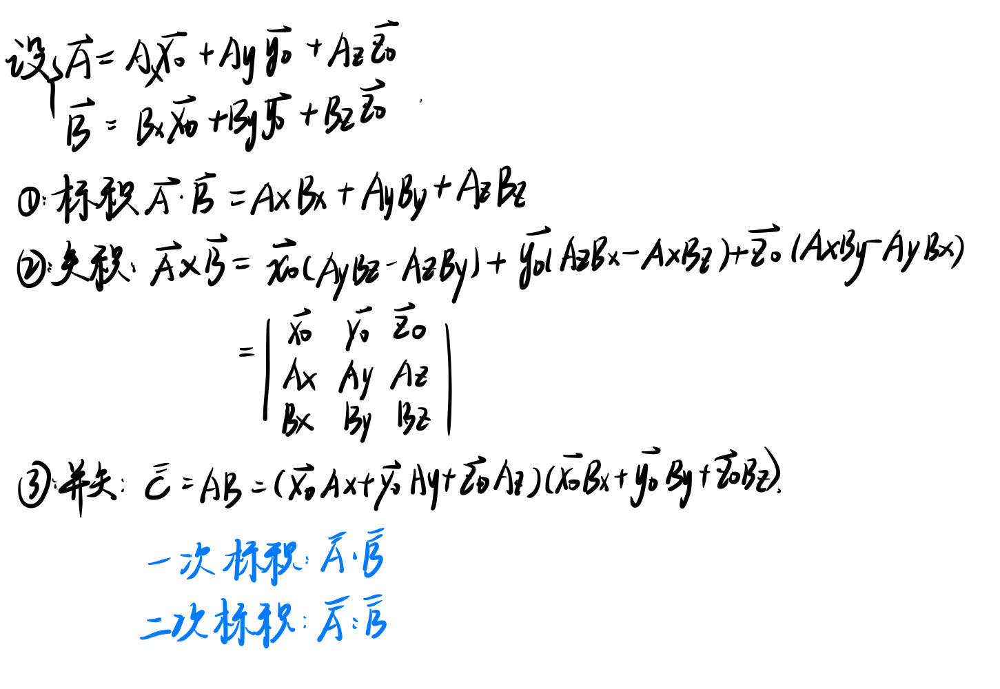

## 1.电磁场的基本概念公式

## 2.电磁波谱

可见光(380THz-770THz)

光波(100THz-1000THz)

其中：

1. 场波可以沿地球的弯曲表面传播到很远---**地波**
2. 短波可以借助60km-300km的高空电离层折射返回地面---**天波**
3. 超短波、微波、光波可以穿过电离层到达外层空间---**空间波**；较常使用微波。但有用传输距离有限的问题，解决方法是建立中继站，如果把中继站建立在人造地球卫星上，通信距离就很大，3颗同步卫星就可覆盖全球大部分面积

## 3.波的基本特征及复表示
### 波动的基本特征
1. 运动的波带有能量
2. 波从一点到另外一点有时间延迟
3. 某些波（如声波与电磁波）具有线性特征

波分为瞬态波和随时间简谐变化的连续波之分。后者的数学表达式（沿+z方向传播）为

$$
A(z,t)=A_0cos(\omega t-kz+\varphi_0)
$$

k被称为波的传播常数，也叫空间频率，特殊记忆的有

$$
k\lambda=2\pi
$$

波等相位点传播的速度

$$
v=\frac{\omega}{k}
$$

### 时谐标量波的复数表示

设随时间变化的电压值 $u(z,t)$ 可以表示为

$$
u(z,t)=U_0cos(\omega t-kz+\varphi_{0u})=U_0cos[\omega t +\varphi_u(z)]
$$

这里，我们记 $\varphi_u(z)=-kz+\varphi_{0u}$

同时，定义相量U

$$
U=U_0e^{j\varphi_u(z)}
$$

于是，原幅值

$$
u(z,t)=Re[Ue^{j\omega t}]
$$

为了简化记号，我们记

$$
u(z,t)\leftrightarrow U 
$$

---
回忆拉普拉斯变换，我们得到了

$$
\begin{align}
\frac{\partial}{\partial t}u(z,t)& \leftrightarrow j\omega U\\
\int u(z,t) dt& \leftrightarrow \frac{U}{jw}
\end {align}
$$

---
时谐变量的时间平均值总是等于0的。

$$
<u(t)>=\frac{1}{T}\int_0^TU_0cos(\omega t +\varphi_u)dt=0
$$

但是两个时谐标量的乘积的平均值不一定总是为0

例如：对于 $U_0cos(\omega t +\varphi_u)$，$I_0cos(\omega t +\varphi_i)$

$$
<u(t)i(t)>=\frac{1}{T}\int_0^TU_0cos(\omega t +\varphi_u)I_0cos(\omega t +\varphi_i)=\frac{1}{2}U_0I_0cos (\varphi_u-\varphi_i)
$$

由此，

$$
<u(t)i(t)>=\frac{1}{2}Re[UI^*]
$$

### 时谐标量波的“复矢量”表示

## 4.矢量分析与场论
### 标积、矢积、并矢

### 梯度、散度、旋度、方向导数
**梯度**
: 梯度是一个向量，它指出了标量场在某一点处增加最快的方向。标量场$F(x, y, z)$的梯度grad f表示为$\nabla F = \frac{\partial F}{\partial x} \hat{i} + \frac{\partial F}{\partial y} \hat{j} + \frac{\partial F}{\partial z} \hat{k}$

**散度**
: 散度是一个标量，它描述了一个矢量场在某一点上的流出或流入程度。
矢量场$\vec{F}(x, y, z)$的散度div f表示为$\nabla \cdot \vec{F} = \frac{\partial F_x}{\partial x} + \frac{\partial F_y}{\partial y} + \frac{\partial F_z}{\partial z}$

**旋度**
: 旋度是一个矢量，它描述了一个矢量场在某一点上的旋转程度或涡旋情况。
矢量场$\vec{F}(x, y, z)$的旋度curl f表示为$\nabla \times \vec{F} = \left( \frac{\partial F_z}{\partial y} - \frac{\partial F_y}{\partial z} \right) \hat{i} + \left( \frac{\partial F_x}{\partial z} - \frac{\partial F_z}{\partial x} \right) \hat{j} + \left( \frac{\partial F_y}{\partial x} - \frac{\partial F_x}{\partial y} \right) \hat{k}$

**方向导数**
: 方向导数是一个标量值，它表示了一个多元函数在某一点沿着某一给定方向的变化率。是梯度在某一方向上的投影。

---

### 场论
**通量**
: $\psi=\int_S A\cdot dS$

$$div \ A =\lim_{\Delta V\to 0}\frac{\oint_{\Delta S} A\cdot dS}{\Delta V}$$

**散度定理**
: $$\oint_{\Delta S} A\cdot dS=\int_V(\nabla \cdot A) dV$$

**拉普拉斯算符**
: $\nabla^2$,当计算梯度的散度时，得到 $\nabla \cdot \nabla A=\nabla^2A$

---
**旋量**
: 
$\Gamma=\oint_{\Delta l}A\cdot dl$

**环量面密度**
: 在场中对于一个点M选取一个方向 $n_0$ ,并作一微小曲面 $\Delta S$ ，$\Delta S$ 的边界为 $\Delta l$ ，如果极限

	$$
	\lim_{\Delta S\to M}\frac{\Delta \Gamma}{\Delta S}=
	\lim_{\Delta S\to M}\frac{\oint_{\Delta l} A\cdot dl}{\Delta S}
	$$

	旋度就定义为

	$$(curl A)\cdot n_0=\lim_{\Delta S\to M}\frac{\oint_{\Delta l} A\cdot dl}{\Delta S}$$

	旋度在某一点给定方向的投影就是该方向的环量面密度，当 $n_0$ 的方向与curl A相同的时候，环量面密度最大。

**斯托克斯定理**
: $$\oint_{\Delta l} A\cdot dl=\oint_{\Delta S} (\nabla \times  A)\cdot dS$$