## 一、传输线方程及其解
### 1.传输线
传输线在电路中相当于一个二端口网络

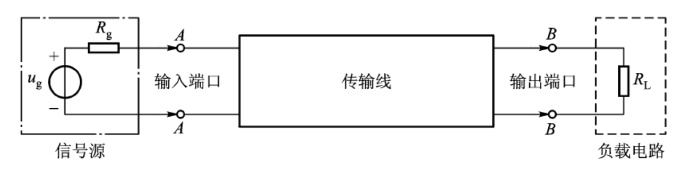

!!! note "常用传输线"

	- 包括平行双导线、同轴线、微带线。其横向尺寸比波长小得多，纵向尺寸比波长大得多，至少与波长可比。
	- 电话网用平行双导线，有线电视网都用同轴线，平行平板波导应用丌多，其变形微带线则广泛用于集成电路
	- 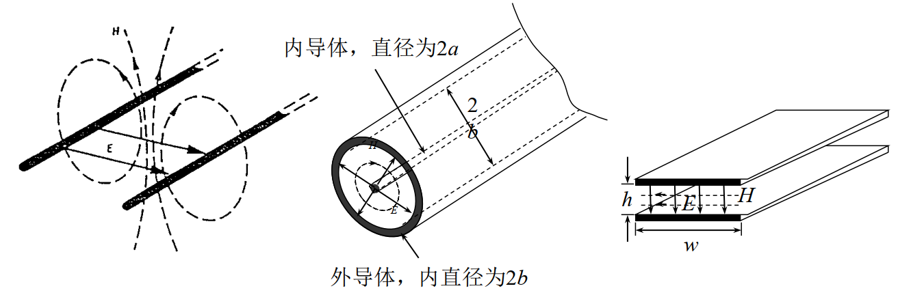

### 2.传输线等效电路
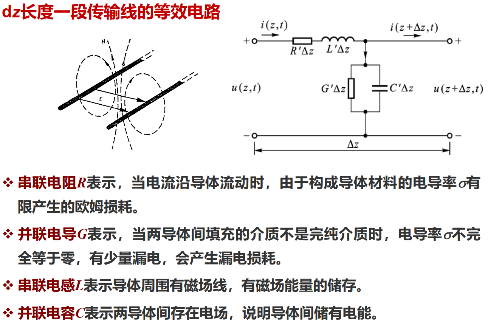
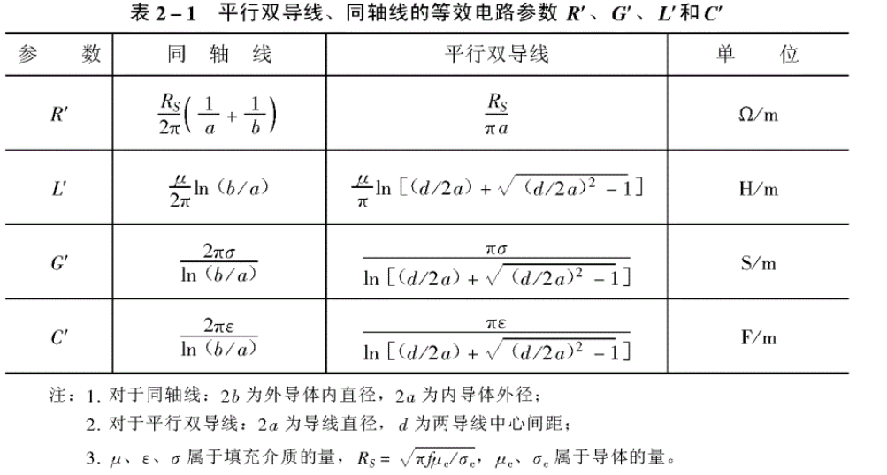
### 3.传输线方程及其求解
**传输线方程：**

$$
\begin{align}
\frac{\partial u(z,t)}{\partial z}&=-[R'i(z,t)+L'\frac{\partial i(z,t)}{\partial z}]\\
\frac{\partial i(z,t)}{\partial z}&=-[G'u(z,t)+C'\frac{\partial u(z,t)}{\partial z}]\\
\end{align}
$$

#### 无损传输线
??? "推导过程（可展开）"
	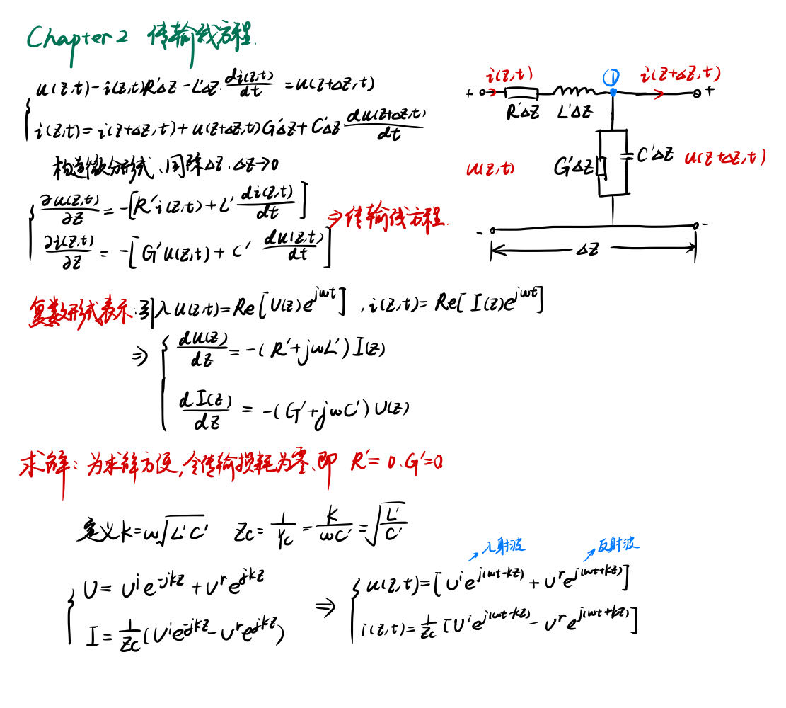

$$
k=\omega\sqrt{L'C'},Z_c=\sqrt{\frac{L'}{C'}}
$$

$$
\begin{align}
U&=U^ie^{-jkz}+U^re^{jkz}
\\
I&=\frac{1}{Z_c}(U^ie^{-jkz}-U^re^{jkz})
\end{align}
$$

---
$$
\begin{align}
u(z,t)&=[U^ie^{j(\omega t-kz)}+U^re^{j(\omega t+kz)}]
\\
i(z,t)&=\frac{1}{Z_c}[U^ie^{j(\omega t-kz)}-U^re^{j(\omega t+kz)}]
\end{align}
$$

!!! NOTE "**无耗传输线方程**解的初步解释"

	1. k为传播常数。
	2.  入射波与反射波相速 $v_p^i=\frac{dz}{dt}=\frac{\omega}{k},v_p^r=\frac{dz}{dt}=-\frac{\omega}{k}$
	3.  对于无损耗线，$k=\omega\sqrt{L'C'}$, 故波的传播速度 $v_p=1/ \sqrt{L'C'}$
	4.  $Z_c$ 为入射波电压与入射波电流之比，具有阻抗量纲，称为**特征阻抗**，$Y_c=1/Z_c$ 称为特征导纳。
	5.  反射波电压与反射波电流相位上刚好相差180°

!!! NOTE "无色散"
	- 平行双导线、同轴线是无色散的。
  
	- 这是因为，将平行双导线、同轴线的L',C'代入，得到 $v_p=1/\sqrt{\varepsilon \mu }$,$\varepsilon$ 与介质有关，如果它与频率无关，那么电磁波传播速度也与频率无关，这就是无色散。

#### 有损耗传输线

R’与G’不再为0，这导致k和Zc将成为复数。

定义

$$
\begin{align}
jk&=\sqrt{(R'+j\omega L')(G'+j\omega C')}\\
Z_c&=\sqrt{\frac{R'+j\omega L'}{G'+j\omega C'}}
\end{align}
$$

传输线方程可以写为

$$
\frac{dU(z)}{dz}=-jkZ_cI(z)
$$

$$
\frac{dI(z)}{dz}=-jkY_cU(z)
$$

解为：

$$
\begin{align}
U&=U^ie^{-jkz}+U^re^{jkz}
\\
I&=\frac{1}{Z_c}(U^ie^{-jkz}-U^re^{jkz})
\end{align}
$$

给予k一些物理意义，如果将k记为 $k=k_r-jk_i$

得到的解为

$$
\begin{align}
U&=U^ie^{-k_iz}e^{-jk_rz}+U^re^{k_iz}e^{jk_rz}
\\
I&=\frac{1}{Z_c}(U^ie^{-k_iz}e^{-jk_rz}-U^re^{k_iz}e^{jk_rz})
\end{align}
$$

可以看到，如果虚部 $k_i>0$ 损耗将使得入射波振幅随z衰减，所以 $k_i$ 被称为波的衰减因子/衰减常数，$k_r$ 称为相位常数，表示波的传播。
## 二、传输线状态的特征量沿传输线的变换
上述，我们用电压U/电流I，或者说是电压入射波/电压反射波来描述特征线的状态，接下来，我们用反射系数、阻抗、驻波系数、驻波相位等特征量表述。
### 1.特征量关系式
??? "推导过程（可展开）"
	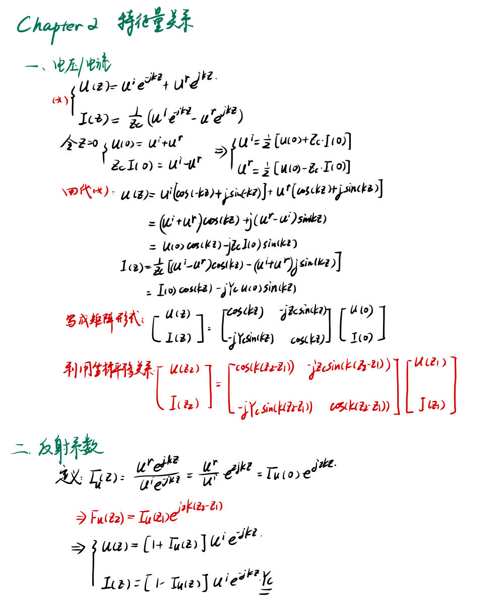
	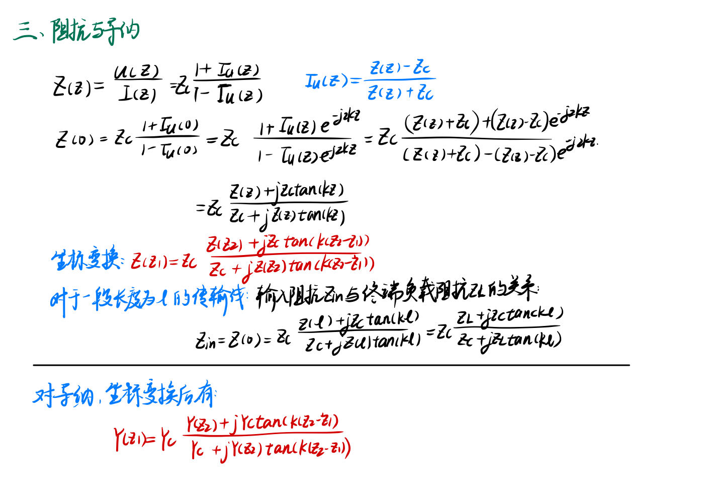

记录三个特征量的方程
=== "电压/电流"
	$$
	\begin{bmatrix}
	U(z_2)\\I(z_2)
	\end{bmatrix}
	=
	\begin{bmatrix}
	cos(k(z_2-z_1))& -jZ_csin(k(z_2-z_1))\\
	-jY_csin(k(z_2-z_1))& cos (k(z_2-z_1))
	\end{bmatrix}
	\begin{bmatrix}
	U(z_1)\\I(z_1)
	\end{bmatrix}
	$$
=== "反射系数"
	$$
	\Gamma_u(z_2)=\Gamma_u(z_1)e^{j2k(z_2-z_1)}
	$$
=== "阻抗与导纳"
	$$
	\begin{align}
	Z(z_2)=Z_c\frac{Z(z_1)-jZ_c tan[k(z_2-z_1)]}{Z_c-jZ(z_1) tan[k(z_2-z_1)]}\\
	Y(z_2)=Y_c\frac{Y(z_1)-jY_c tan[k(z_2-z_1)]}{Y_c-jY(z_1) tan[k(z_2-z_1)]}
	\end{align}
	$$	

### 2.沿传输线变换的图示
假设以传播系数为k,特征阻抗为Zc为例，在输出终端 $z=0$ 处接负载 $Z_L=R_L+jX_L$ ，探索 $z<0$ 的特征量

#### 反射系数
终端
$$
\Gamma_u(0)=\frac{Z_L-Z_c}{Z_L+Z_c}=|\Gamma_u(0)|e^{j\varphi(0)}
$$

其中，

$$|\Gamma_u(0)|<1$$

$$
\varphi(0)=\arctan \frac{2X_LZ_C}{R_L^2+X_L^2-Z_C^2}
$$

根据公式，可以获得$-l<0$处的反射系数

$$
\Gamma_u(-l)=\Gamma_u(0)e^{j2k(-l)}=|\Gamma_u(0)|e^{j[\varphi(0)-2kl]}
$$

可见，反射系数的变化只是相角的变化，随着l增加，沿顺时针转，$l$ 增加 $\lambda/2$ 时，相位变化重复一次。

---
#### 电压、电流

$$
\begin{align}
|\frac{U(z=-l)}{U^ie^{jkl}}|=|1+\Gamma_u(z=-l)|\\
|\frac{I(z=-l)}{U^ie^{jkl}/Z_c}|=|1-\Gamma_u(z=-l)|\\
\end{align}
$$

当入射波电压幅值为1时，

$$
\begin{align}
|U(z=-l)|=|1+\Gamma_u(z=-l)|\\
Z_c|I(z=-l)|=|1-\Gamma_u(z=-l)|\\
\end{align}
$$

可以理解为电压、电流的幅值大小在一个圆上旋转。
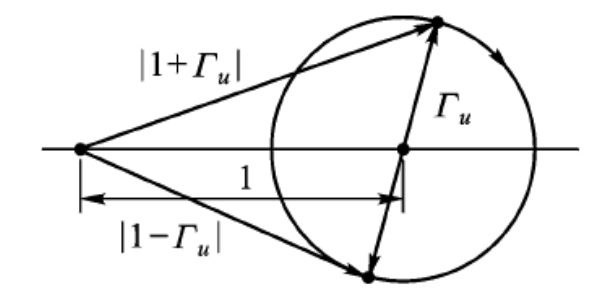

!!! NOTE "驻波系数与驻波相位"
	- 驻波系数VSWR为电压的最大值与最小值之比
	$$ \rho=\frac{U_{max}}{U_{min}}= \frac{1+|\Gamma_u|}{1-|\Gamma_u|}$$
	- 定义第一个电压腹点为 $d_{max1}=\frac{\varphi(0)}{2k}$,
	第一个电压节点为 $d_{min1}=d_{max1}+\frac{\lambda}{4}$
	驻波相位为
	$$\tilde{d}_{min1}=\frac{{d}_{min1}}{\lambda}$$

!!! NOTE "特殊情况的电流电压分布"
	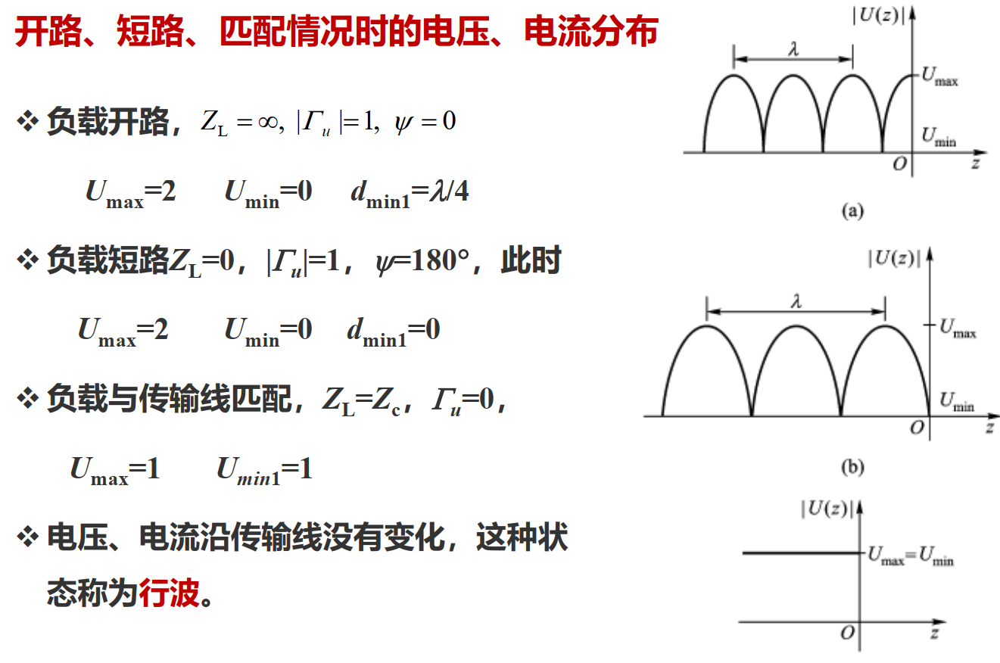

--- 
#### 阻抗（导纳）

$$
Z_{in}=Z_c\frac{Z_L+jZ_c tan\ kl}{Z_c+jZ_L tan\ kl}
$$

1. 匹配时，可以得到 $Z(z)=Z_c$ 
2. 终端开路，$Z_L=Z(0)=\infty$ ,$Z_{in}(z=-l)=\frac{Z_c}{jtankl}$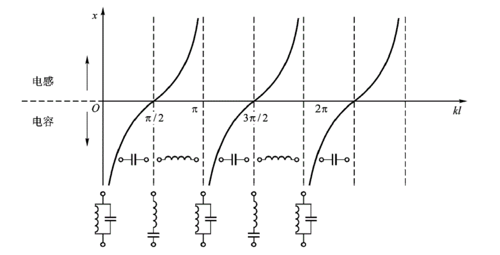
3. 终端短路，$Z_L=Z(0)=0$ ,$Z_{in}(z=-l)=jZ_c{tankl}$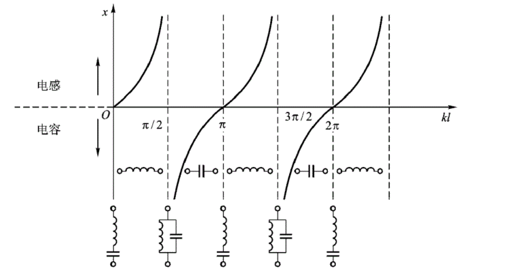
## 三、传输功率与传输效率  
### 1.传输功率

$$
\begin{align}
P(z)&=\frac{1}{2}Re[U(z)\cdot I^*(z)]\\
&=\frac{1}{2}Re[ \frac{|U^i|^2}{Z_c^*}-\frac{|U^i|^2}{Z_c^*}|\Gamma_u(z)|^2+\frac{|U^i|^2}{Z_c^*}(\Gamma_u(z)-\Gamma^*_u(z)) ]\\
\end{align}
$$

对于无损耗传输线，$Z_c$ 是实数，则上述第三项等于0.

$$
P=\frac{1}{2}( \frac{|U^i|^2}{Z_c^*}-\frac{|U^i|^2}{Z_c^*}|\Gamma_u|^2)=P^i-P^r
$$

这说明，传输线上任一点功率等于入射波功率与反射波功率之差。而且 $\frac{P^r}{P^i}=|\Gamma_u|^2$
!!! note "功率容量"

	便于计算功率，我们根据线上任意传输功率相同，取电压腹点/节点计算。

	$$
	P=\frac{1}{2}|U_{max}|\cdot|I_{min}|=\frac{1}{2}\frac{|U_{max}|^2}{Z_c \rho}
	$$

	可见，当传输线的耐压一定或者电流一定，驻波系数 $\rho$ 越趋近于1，传输功率越大。

	在这个基础上，定义传输线允许传递的最大功率为传输线的**功率容量**

	$$
	P_{br}=\frac{1}{2}\frac{|U_{max}|^2}{Z_c }
	$$

### 2.传输效率

$$
\eta=\frac{P_L}{P_{in}}(\%)=\frac{1-|\Gamma_u(0)|^2}{e^{2k_il}-|\Gamma_u(0)|^2e^{-2k_il}}
$$

进一步地，利用指数函数和双曲函数之间的关系

$$
\eta=\frac{1}{cosh(2k_il)+\frac{1}{2}(\rho+\frac{1}{\rho})sinh(2k_il)}
$$

如果传输线损耗比较小，或者传输线长度比较小，$k_il<<1$，那么

$$
\eta=\frac{1}{1+(\rho+\frac{1}{\rho})k_il}\approx1-(\rho+\frac{1}{\rho})k_il
$$