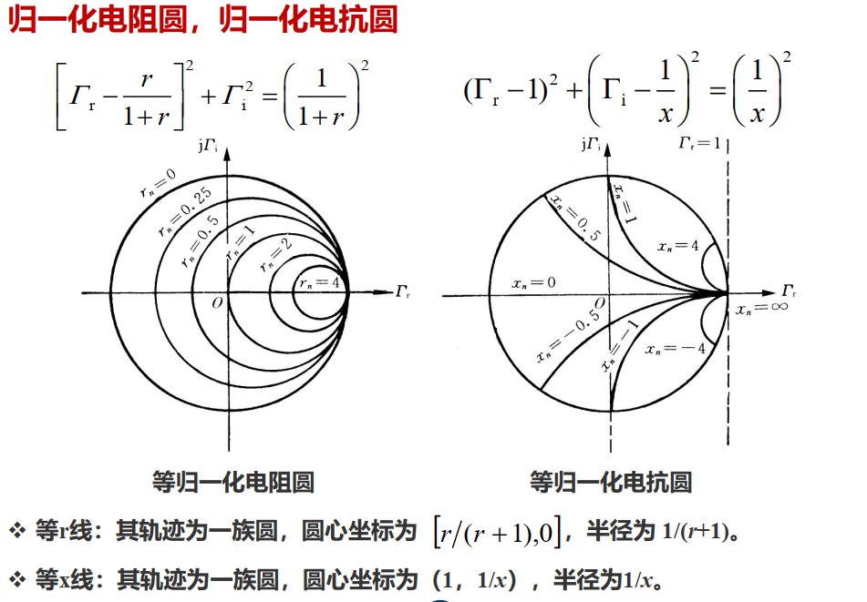
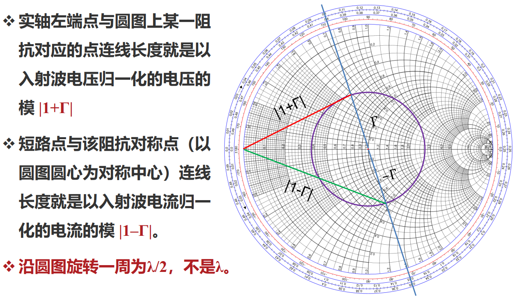
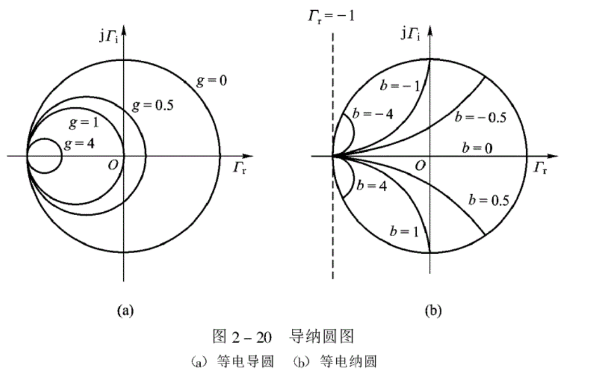
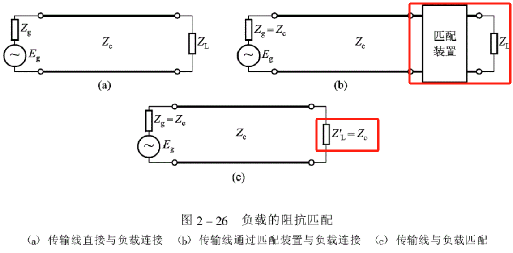
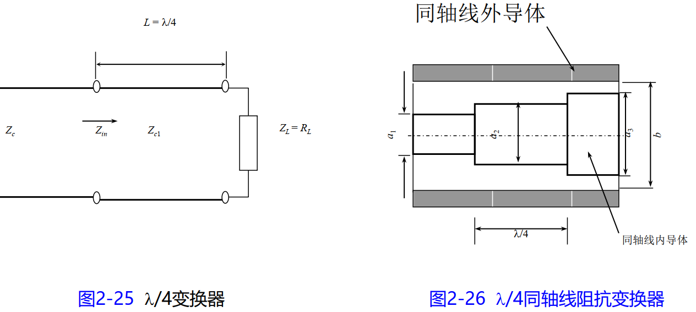
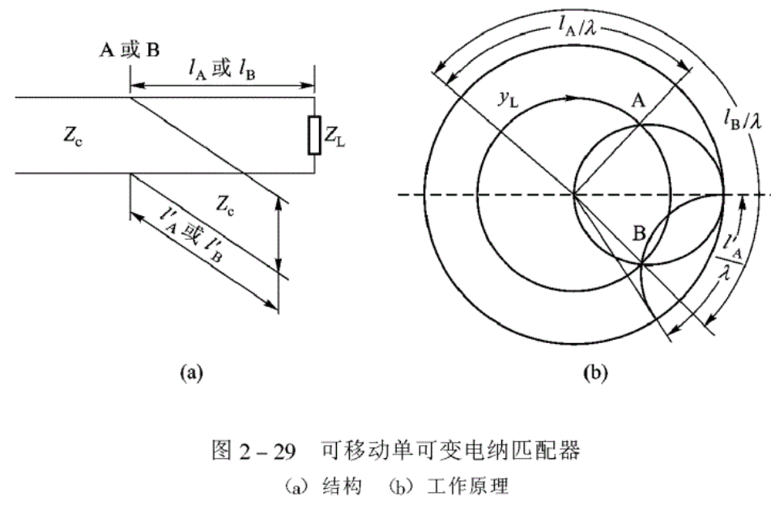
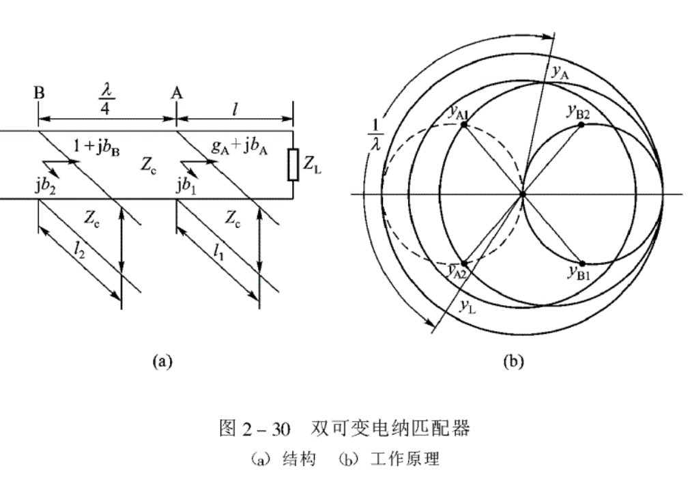

> 在工程中经常会遇到阻抗匹配/阻抗计算的问题，根据以上公式计算较麻烦---使用传输线圆图。在介绍传输线圆图后，介绍了几类匹配器，用于实现特征阻抗匹配。
## 一、阻抗圆图
### 1.阻抗计算的两种途径
1. 直接代入公式 $Z_{in}=Z_c\frac{Z(z_1)-jZ_c tan[k(z_2-z_1)]}{Z_c-jZ(z_1) tan[k(z_2-z_1)]}$
2. 通过反射系数作中间变量
### 2.传输线圆图
> 思路是在反射系数的圆图上把阻抗以适当的方式标出，在图上进行输入阻抗的计算。
令 $z(z)=\frac{Z(z)}{Z_c}=\frac{1+\Gamma_u(z)}{1-\Gamma_u(z)}=r+jx$,$\Gamma=\Gamma_r+j\Gamma_i$

### 3.圆图上部分特征点、线、区域的意义

## 二、导纳圆图
对应的单位导纳为

$$
y(z)=g+jb=\frac{1+\Gamma_i(z)}{1-\Gamma_i(z)}
$$

推导所得方程相同---导纳圆图与阻抗圆图具有相同形状，且阻抗圆图转过 $\pi$ 后就得到导纳圆图。

注意：导纳圆图的上半部分 $b<0$ ，下半部分 $b<0$

## 三、阻抗匹配及阻抗匹配器
> 当传输线与负载匹配时，传输线处于行波状态，传输的功率大、频率高。传输线的阻抗匹配包括两个方面：信号源与传输线的匹配与负载与传输线的匹配。
> 
> 由于信号源可以通过隔离器/环形器与传输线连接，所以我们重点讨论负载与传输线的匹配。对匹配的基本思路时负载不匹配引起的反射刚好被匹配器引入的反射相抵消，使得匹配装置左边看进去的输入阻抗等于传输线特征阻抗。

### 1.$\lambda/4$ 变换器
- 如果负载阻抗是纯电阻，可用$\lambda/4$ 阻抗变换器迚行匹配。**阻抗变换器**是一段长度为$\lambda/4$ 的传输线，特征阻抗$$Z_{c1}=\sqrt{R_LZ_c}$$
- 如果负载不是纯电阻，但仍要用$\lambda/4$ 变换器进行匹配，那么就需要将$\lambda/4$ 变换器接在离负载一段距离的电压波节戒电压波腹处

!!!NOTE "参数限制"
	- 
	- 变换段的几何特征应该满足$$ ln(\frac{b}{a_1})ln(\frac{b}{a_3})=ln^2(\frac{b}{a_2}) $$

### 2.并联支路可变电纳匹配器
> 在主传输线上并联一个/数个短路面位置可调的支路传输线（相当于并联一个可变电纳），被称为并联支路可变电纳匹配器。
> 经过这样匹配器的变换，从源向负载看过去的归一化导纳在圆图上位于g=1,b=0(r=1,x=0)的匹配点。
#### 可移动单可变电纳匹配器
1. 调节连接点与负载之间的点长度使得 $y'_{in}$ 落在g=1等g圆上
2. 调节并联支路短路面位置使得归一化电纳为 $-jb'_{in}$

#### 双可变电纳匹配器
1. L经主传输线变化（顺时针）到A
2. 调节第一个并联电路位置，使得A随等r圆到A1/A2(与虚线圆相交)
3. 经过 $\lambda/4$ 变换，到B1/B2，此时g=1
4. 经过第二个并联电路调节，使得输入导纳为1.

如果A在g=1的圆内，那么它就不能实现匹配，即存在一定的盲区。
#### 三可变电纳匹配器
在三可变电纳匹配器中，如果对于第一、第二个并联支线组成的双可变电纳匹配器，负载位于不匹配的“死区”，那么对于第二第三个并联支线组成的双可变电纳匹配器，要匹配的负载就一定出“死区”。

因为经过第一、第二个并联支线间$\lambda/4$传输线的变换沿等$|\Gamma_L|$线转过180°，一定不在g=1的圆内。

## 四、传输线的瞬态响应
时域分析的稳态

$$
\begin{align}
U_{\infty}&=\frac{U_gZ_L}{R_g+Z_L}\\
U_{\infty}&=\frac{Z_L}{R_g+Z_L}\\
\end{align}
$$

频域分析使用傅里叶变换。